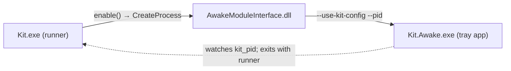
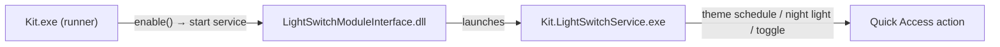
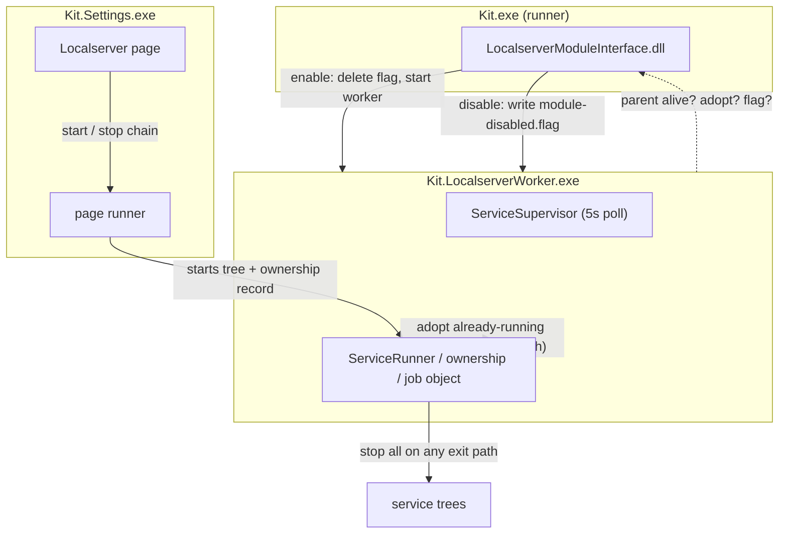
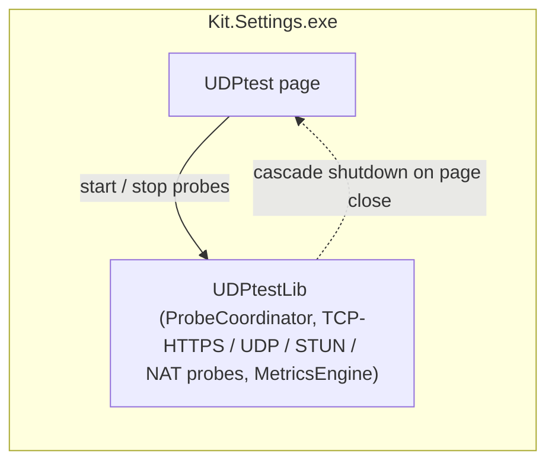
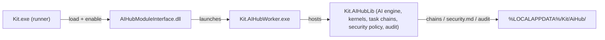

# Kit

**Language / 语言:** English | [中文](README_zh.md)

---

## 1. What Is Kit

Kit is a local, self-use Windows utility workspace derived from **Microsoft PowerToys**. It exists so selected PowerToys utilities can be modified, isolated, and compared against an installed official PowerToys build on the same machine.

It is a **stability-first PowerToys-derived workspace, not a full product rebrand**: the upstream runner, module interface, settings, and dashboard patterns are kept recognizable, so imported PowerToys modules can be validated with minimal adapter code.

| Keeps | Changes |
| --- | --- |
| PowerToys runner / module-interface / settings / dashboard patterns | Branding (`Kit`), window titles, visible UI text |
| The `KitModuleIface` C++ contract (with `PowertoyModuleIface` aliases) | Settings storage under `%LOCALAPPDATA%\Kit` (not the official PowerToys directory) |
| The explicit module-loading model | Automatic update, download, and telemetry surfaces are removed |
| PowerToys-imported modules: `Awake`, `Light Switch`; Kit-developed plugins: `Localserver`, `UDPtest`, `AI Hub` | Backup/restore defaults use Kit branding (`Documents\Kit\Backup`, `HKCU\Software\Microsoft\Kit`) |

Current version: `2.3.0`.

---

## 2. Kit Main Architecture

### 2.1 Process and component overview

| Component | Executable / Project | Role |
| --- | --- | --- |
| **Runner** | `Kit.exe` (`src/runner`) | Loads module interface DLLs, owns module lifetime, hosts the tray icon, coordinates settings IPC, launches the Settings and Quick Access apps |
| **Settings app** | `Kit.Settings.exe` (`src/settings-ui/Settings.UI`, WinUI 3) | Home, General, per-module pages, navigation, page-level view models |
| **Quick Access** | `Kit.QuickAccess.exe` (`src/settings-ui/Settings.UI.Controls`) | Quick actions / dashboard shortcuts |
| **Module interfaces** | `Kit.<Module>ModuleInterface.dll` (`src/modules/*/...ModuleInterface`, C++) | Loaded into the runner process; implement `KitModuleIface` |
| **Workers / services** | e.g. `Kit.Awake.exe`, `Kit.LightSwitchService.exe`, `Kit.LocalserverWorker.exe`, `Kit.AIHubWorker.exe` | Headless processes launched by module interfaces; host per-module engines so behavior survives Settings closing |
| **Shared libs** | `src/common` (interop WinMD, managed libs, `Logger`, settings helpers) | Common infrastructure used by runner, modules, and Settings |

Runtime layout next to `Kit.exe`:

```
<runner dir>/
├── Kit.exe
├── Kit.<Module>ModuleInterface.dll          # loaded by the runner
├── LocalserverWorker/Kit.LocalserverWorker.exe
├── AIHubWorker/Kit.AIHubWorker.exe
├── Kit.Awake.exe
├── Kit.LightSwitchService.exe
└── WinUI3Apps/
    ├── Kit.Settings.exe
    └── Kit.QuickAccess.exe
```

### 2.2 Startup and lifecycle

1. The runner boots, loads the known module interface DLLs (`KitKnownModules` in `src/runner/main.cpp`), calls `kit_create()` on each, and enables the modules that are turned on in settings.
2. The runner launches the Settings app over named pipes and shows the tray icon.
3. Enabling/disabling a module in Settings is sent over IPC; the runner applies it via `apply_module_status_update` → `enable()` / `disable()` on the module object.
4. Shutdown: when the message loop ends (tray exit, or Settings closed without a tray icon), the runner tears down modules (`modules().clear()` → `destroy()`), which lets each module clean up its worker and services before the process exits.

### 2.3 Module interface contract (`KitModuleIface`)

Defined in `src/modules/interface/kit_module_interface.h`. A module DLL exports `kit_create()` returning an object implementing:

- `get_key()` — non-localized module ID
- `enable()` / `disable()` / `is_enabled()` — lifecycle
- `get_config()` / `set_config()` — settings JSON schema and updates
- `call_custom_action()` — custom UI actions
- `get_hotkeys()` / `on_hotkey()` — hotkey registration and dispatch
- `destroy()` — free all resources, delete the instance (called at teardown)

### 2.4 Generic plugin skeleton

Every Kit module follows the same five-piece skeleton:

1. **Native module interface DLL** (C++) — the runner-facing contract, enabled/disabled with the module.
2. **Core library** — the engine, either managed (`LocalserverLib`, `UDPtestLib`, `AIHubLib`) or native (`LightSwitchLib`).
3. **Optional worker/service executable** — a headless process that hosts the engine outside the Settings process.
4. **Settings page + view model** (WinUI 3) — the per-module UI in the Settings app.
5. **Registration points** — runner `KitKnownModules`, Settings navigation/routes, Home dashboard metadata, and tests.

### 2.5 Data and log layout

All runtime data lives under `%LOCALAPPDATA%\Kit`:

| Path | Purpose |
| --- | --- |
| `settings.json` | General settings |
| `RunnerLogs\` | Runner log |
| `crash.log` | First-chance / unhandled exception log |
| `<ModuleKey>\` | Per-module data: settings, state, logs, catalogs (e.g. `Localserver\services.json`, `Localserver\State\`, `AiHub\chains\`) |
| `<ModuleKey>\Logs\<version>\` | Versioned module/worker logs |

---

## 3. Plugin Architecture Skeleton Analysis

The five active modules split into two groups:

- **PowerToys-imported (first-party)** — `Awake`, `Light Switch`: adapted from upstream PowerToys modules onto Kit's contract.
- **Kit-developed plugins** — `Localserver`, `UDPtest`, `AI Hub`: built for Kit's own local use.

### 3.1 Awake — keep-awake utility



- **Skeleton**: module interface DLL + standalone tray executable. No in-process engine.
- **Components**: `AwakeModuleInterface.dll` (C++) → launches `Kit.Awake.exe` (`src/modules/awake/Awake`, C# WinExe) with `--use-kit-config --pid <kit_pid>`.
- **Lifecycle**: enabling the module launches the tray app, which keeps the system awake per the configured mode (indefinite / timer / battery-aware) and exits when the runner dies (watches `kit_pid`).
- **Data**: `%LOCALAPPDATA%\Kit\Awake\`.

### 3.2 Light Switch — scheduled theme switching



- **Skeleton**: module interface DLL + native core lib + native service executable.
- **Components**: `LightSwitchModuleInterface.dll`, `LightSwitchLib` (C++ core), `Kit.LightSwitchService.exe`.
- **Lifecycle**: enabling the module starts the service, which applies the theme schedule, night light, and the toggle hotkey. It keeps a direct Quick Access action.
- **Data**: `%LOCALAPPDATA%\Kit\LightSwitch\`.

### 3.3 Localserver — local service orchestration (deepest skeleton)



- **Skeleton**: module interface DLL + managed core lib + headless worker; the Settings page also hosts page-level runners.
- **Components**: `LocalserverModuleInterface.dll`, `Kit.LocalserverWorker.exe`, `LocalserverLib` (catalog store, `ServiceSupervisor`, `ServiceRunner`, ownership records, named job objects).
- **Lifecycle**:
  - Enabling the module only makes the catalog available — it **never auto-starts** services. Each service (e.g. Deepseek, Hongguo) is started individually from the Settings page; the worker *adopts* already-running process trees instead of relaunching them.
  - The worker polls every 5 s: parent alive? adopt page-started chains? module-disable flag present?
  - Disabling the module writes `module-disabled.flag`; the worker stops every supervised service and exits gracefully (up to 8 s, then force-terminated).
  - On **any** exit path (flag, parent died, shutdown), the worker stops all supervised services, so no orphaned process tree survives.
- **Data**: `%LOCALAPPDATA%\Kit\Localserver\` — `services.json` (catalog), `State\` (ownership), `settings.json`, `module-disabled.flag`, `Logs\<version>\`.

### 3.4 UDPtest — network probe engine



- **Skeleton**: module interface DLL + managed core lib, **no separate process** — the probe engine runs in-process in the Settings page.
- **Components**: `UDPtestModuleInterface.dll`, `UDPtestLib` (`ProbeCoordinator`, TCP-HTTPS / UDP-echo / STUN / NAT-type probes, `MetricsEngine`, sparkline telemetry).
- **Lifecycle**: the page starts/stops coordinated probes and shuts the cascade down when the page closes; no worker is involved.
- **Data**: `%LOCALAPPDATA%\Kit\UDPtest\`.

### 3.5 AI Hub — unified AI service + security audit



- **Skeleton**: module interface DLL + managed core lib + headless worker.
- **Components**: `AIHubModuleInterface.dll`, `Kit.AIHubWorker.exe`, `Kit.AIHubLib` (AI service engine, kernels, task chains, security policies, audit pipeline).
- **Lifecycle**: the worker hosts the shared AI service (kernels, main/fallback endpoints, global security policy); task chains carry per-task `AGENTS.md` policies; the Security Audit collects Windows event logs, ranks findings, and runs AI analysis.
- **Data**: `%LOCALAPPDATA%\Kit\AiHub\` — `chains\`, `kernels\`, `requests\`, `State\`, `security.md`, `settings.json`, `secrets.dat`, `Logs\`.

## 4. Build and Release

- Build: `tools/build/build.ps1` (single project) and `tools/build/build-essentials.ps1` (solution restore + essentials); both auto-detect `x64` and initialize the VS environment.
- Version source: `src/Version.props`; the generated header lives under `src/common/version/Generated Files/version_gen.h`.
- Outputs: x64 builds land in `x64/<Configuration>/` (`Kit.exe`, `WinUI3Apps\`, module DLLs, workers); `tools/build/Stage-Debug.ps1` / `Stage-Release.ps1` produce staged test/package directories.
- `x64`, `Debug`, `Release`, `.vs`, `TestResults`, project `bin`/`obj`, and root `packages` are disposable build state and can be removed after a handoff; the next build regenerates them.

---

## 5. Module Compatibility and Extension

Kit follows the PowerToys module-loading model instead of inventing a new plugin protocol. The runner loads known module interface DLLs through the maintained `KitKnownModules` list in `src/runner/main.cpp`:

- `Kit.AwakeModuleInterface.dll`
- `Kit.LightSwitchModuleInterface.dll`
- `Kit.LocalserverModuleInterface.dll`
- `Kit.UDPtestModuleInterface.dll`
- `Kit.AIHubModuleInterface.dll`

Two of the five modules are imported from upstream PowerToys (`Awake`, `Light Switch`); the other three are Kit-developed plugins (`Localserver`, `UDPtest`, `AI Hub`). The fixed list is intentional: it avoids unstable directory probing and makes every module an explicit decision, whether imported or self-developed. A third-party plugin host (`plugins/` + `manifest.json`) is planned but not implemented yet.

### Adding another PowerToys module

1. Copy the module source, keeping its upstream project shape.
2. Add its projects and build dependencies to `Kit.slnx`.
3. Add its interface DLL to the runner `KitKnownModules` list.
4. Add Settings navigation, route mapping, and page/view model inclusion.
5. Keep upstream CsWinRT references; build once from a clean Release tree so `Kit.Interop` / `Kit.GPOWrapper` projections regenerate.
6. Add Home dashboard metadata and Quick Access behavior only when relevant.
7. Add static/unit coverage for the runner list, routes, dashboard, and Quick Access.
8. Validate targeted builds before whole-solution builds.

---

## 6. Stability Direction

- Prefer upstream PowerToys patterns and small deltas over new local abstractions.
- Keep module registration explicit until the runner/settings/module compatibility is boringly stable.
- Keep Settings, runner, module interface, Quick Access, and copied module projects buildable independently before widening to whole-solution builds.
- Keep Kit storage, backup, window title, and visible text separate from an installed official PowerToys.
- Do not re-enable automatic download/install or telemetry.
- Split new modules into a testable core library, worker process, native module interface, settings model, settings page, Home metadata, and registration tests.

---

## 7. Documentation

- [PLUGIN_DEVELOPMENT.md](PLUGIN_DEVELOPMENT.md) — Kit plugin and module requirements: the C++ contract, registration, WinUI 3 + Mica Alt, logo specs, isolated data paths, lifecycle, and templates.
- `doc/devdoc/kit-architecture.md` — Kit architecture reference (lightweight plugin-host direction).
- `doc/devdoc/powertoys-architecture.md` — verified upstream PowerToys framework architecture (Chinese).
- `doc/devdoc/architecture-comparison.md` — PowerToys vs Kit comparison and startup optimization analysis (Chinese).
- `doc/devdoc/kit-first-plugin.md` — first-module checklist and validation baseline.
- `doc/devdoc/kit-development-experience.md` — first-phase lessons learned and stabilization checklist.
- `doc/devdoc/startup-optimization-analysis.md` — startup optimization analysis (Chinese).
- `fix.md` — upstream delta and fix list; `changelog.md` — version history.

## 8. Changelog

See [changelog.md](changelog.md) for the full version history.
