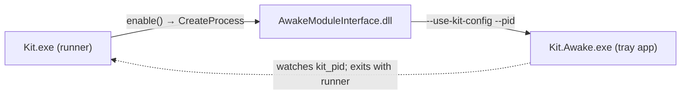
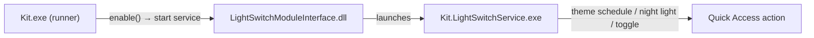
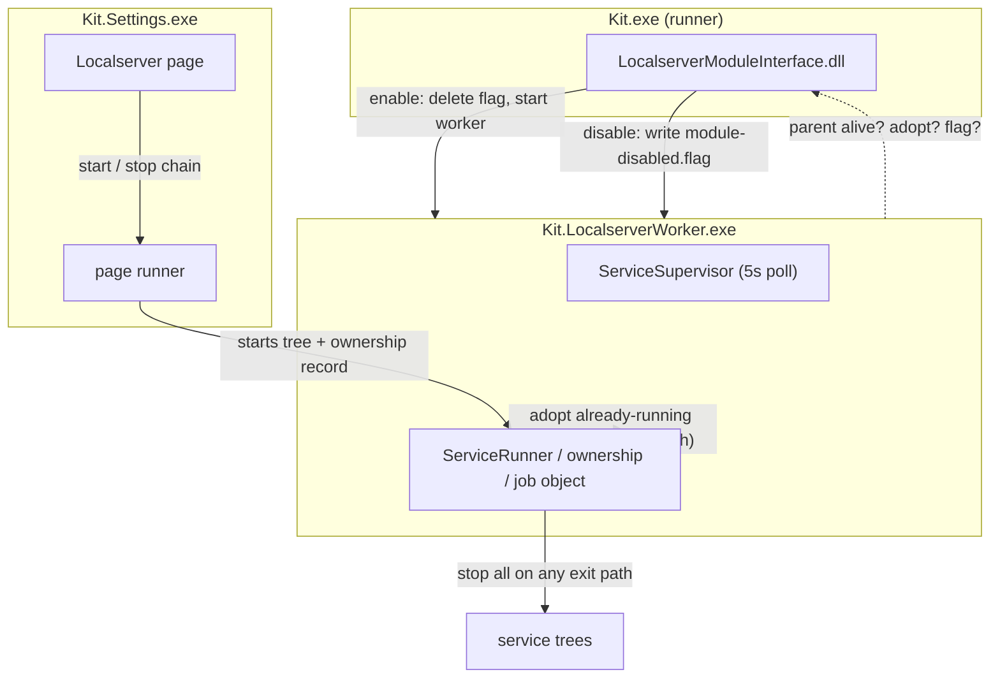
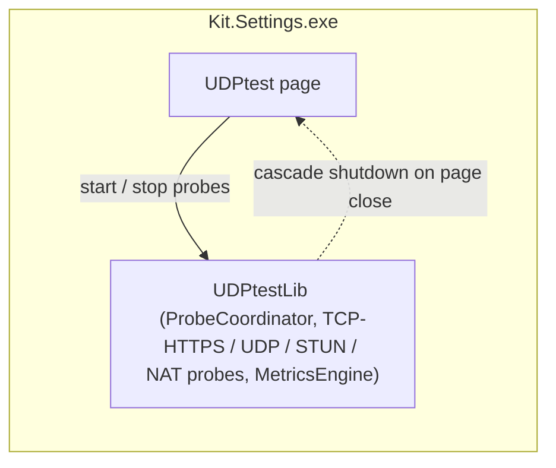
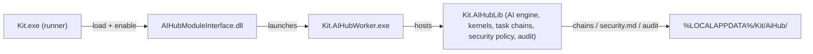

# Kit

**Language / 语言:** English | [中文](README_zh.md)

---

## 1. What Is Kit

Kit is a local, self-use Windows utility workspace derived from Microsoft PowerToys. It exists so selected PowerToys utilities can be modified, isolated, and compared against an installed official PowerToys build on the same machine.

It is a **stability-first PowerToys-derived workspace, not a full product rebrand**: the upstream runner, module interface, settings, and dashboard patterns are kept recognizable, so imported PowerToys modules can be validated with minimal adapter code.

| Keeps | Changes |
| --- | --- |
| PowerToys runner / module-interface / settings / dashboard patterns | Branding (`Kit`), window titles, visible UI text |
| The `KitModuleIface` C++ contract (with `PowertoyModuleIface` aliases) | Settings storage under `%LOCALAPPDATA%\Kit` (not the official PowerToys directory) |
| The explicit module-loading model | Automatic update, download, and telemetry surfaces are removed |
| PowerToys-imported modules: `Awake`, `Light Switch`; Kit-developed plugins: `Localserver`, `UDPtest`, `AI Hub`, `NetMap` | Backup/restore defaults use Kit branding (`Documents\Kit\Backup`, `HKCU\Software\Microsoft\Kit`) |

Current Kit version: `2.3.4`.

---

## 2. Kit Main Architecture

### 2.1 Process and component overview

| Component | Executable / Project | Role |
| --- | --- | --- |
| **Runner** | `Kit.exe` (`src/runner`) | Loads module interface DLLs, owns module lifetime, hosts the tray icon, coordinates settings IPC, launches the Settings and Quick Access apps |
| **Settings app** | `Kit.Settings.exe` (`src/settings-ui/Settings.UI`, WinUI 3) | Home, General, per-module pages, navigation, page-level view models |
| **Quick Access** | `Kit.QuickAccess.exe` (`src/settings-ui/Settings.UI.Controls`) | Quick actions / dashboard shortcuts |
| **Module interfaces** | `Kit.<Module>ModuleInterface.dll` (`src/modules/*/...ModuleInterface`, C++) | Loaded into the runner process; implement `KitModuleIface` |
| **Workers / services** | e.g. `Kit.Awake.exe`, `Kit.LightSwitchService.exe`, `Kit.LocalserverWorker.exe`, `Kit.AIHubWorker.exe` | Headless processes launched by module interfaces; host per-module engines so behavior survives Settings closing |
| **Shared libs** | `src/common` (interop WinMD, managed libs, `Logger`, settings helpers) | Common infrastructure used by runner, modules, and Settings |

Runtime layout next to `Kit.exe`:

```
<runner dir>/
├── Kit.exe
├── Kit.<Module>ModuleInterface.dll          # loaded by the runner
├── LocalserverWorker/Kit.LocalserverWorker.exe
├── AIHubWorker/Kit.AIHubWorker.exe
├── Kit.Awake.exe
├── Kit.LightSwitchService.exe
└── WinUI3Apps/
    ├── Kit.Settings.exe
    ├── Kit.QuickAccess.exe
    ├── Kit.NetMapLib.dll                   # NetMap runs inside Settings
    └── modules/NetMap/                     # third-party license notices
```

### 2.2 Startup and lifecycle

1. The runner boots, shows the tray icon and — when Settings should open — launches the Settings app over named pipes **before** loading modules, so the WinUI/.NET cold start of Settings overlaps with module loading. IPC that arrives early is queued and handled once the message loop starts.
2. The runner loads the known module interface DLLs (`KitKnownModules` in `src/runner/main.cpp`), calls `kit_create()` on each, and enables the modules that are turned on in settings.
3. Enabling/disabling a module in Settings uses the PowerToys `module_status` IPC message; the runner applies GPO policy and calls the module's native `enable()` / `disable()` interface, then returns `get_all_settings()` so Settings can synchronize Utilities from each module's actual `is_enabled()` state. The settings-file watcher remains as a fallback for external changes. Kit does not expose PowerToys' experimentation toggle or its related policy.
4. Shutdown: when the message loop ends (tray exit, or Settings closed without a tray icon), the runner tears down modules (`modules().clear()` → `destroy()`), which lets each module clean up its worker and services before the process exits.

### 2.3 Module interface contract (`KitModuleIface`)

Defined in `src/modules/interface/kit_module_interface.h`. A module DLL exports `kit_create()` returning an object implementing:

- `get_key()` — non-localized module ID
- `enable()` / `disable()` / `is_enabled()` — lifecycle
- `get_config()` / `set_config()` — settings JSON schema and updates
- `call_custom_action()` — custom UI actions
- `get_hotkeys()` / `on_hotkey()` — hotkey registration and dispatch
- `destroy()` — free all resources, delete the instance (called at teardown)

### 2.4 Generic plugin skeleton

Every Kit module follows the same five-piece skeleton:

1. **Native module interface DLL** (C++) — the runner-facing contract, enabled/disabled with the module.
2. **Core library** — the engine, either managed (`LocalserverLib`, `UDPtestLib`, `AIHubLib`, `NetMapLib`) or native (`LightSwitchLib`).
3. **Optional worker/service executable** — a headless process that hosts the engine outside the Settings process.
4. **Settings page + view model** (WinUI 3) — the per-module UI in the Settings app.
5. **Registration points** — runner `KitKnownModules`, Settings navigation/routes, Home dashboard metadata, and tests.

### 2.5 Data and log layout

All runtime data lives under `%LOCALAPPDATA%\Kit`:

| Path | Purpose |
| --- | --- |
| `settings.json` | General settings |
| `RunnerLogs\` | Runner log |
| `crash.log` | First-chance / unhandled exception log |
| `<ModuleKey>\` | Per-module data: settings, state, logs, catalogs (e.g. `Localserver\services.json`, `Localserver\State\`, `AiHub\chains\`) |
| `<ModuleKey>\Logs\<version>\` | Versioned module/worker logs |

---

## 3. Plugin Architecture Skeleton Analysis

The six active modules split into two groups:

- **PowerToys-imported (first-party)** — `Awake`, `Light Switch`: adapted from upstream PowerToys modules onto Kit's contract.
- **Kit-developed plugins** — `Localserver`, `UDPtest`, `AI Hub`, `NetMap`: built for Kit's own local use.

### 3.1 Awake — keep-awake utility


```mermaid
flowchart LR
    R["Kit.exe (runner)"]
    MI["AwakeModuleInterface.dll"]
    A["Kit.Awake.exe (tray app)"]
    R -->|"enable() → CreateProcess"| MI
    MI -->|"--use-kit-config --pid <kit_pid>"| A
    A -.->|"watches kit_pid; exits with runner"| R
```

- **Skeleton**: module interface DLL + standalone tray executable. No in-process engine.
- **Components**: `AwakeModuleInterface.dll` (C++) → launches `Kit.Awake.exe` (`src/modules/awake/Awake`, C# WinExe) with `--use-kit-config --pid <kit_pid>`.
- **Lifecycle**: enabling the module launches the tray app, which keeps the system awake per the configured mode (indefinite / timer / battery-aware) and exits when the runner dies (watches `kit_pid`).
- **Data**: `%LOCALAPPDATA%\Kit\Awake\`.

### 3.2 Light Switch — scheduled theme switching


```mermaid
flowchart LR
    R["Kit.exe (runner)"]
    MI["LightSwitchModuleInterface.dll"]
    LS["Kit.LightSwitchService.exe"]
    R -->|"enable() → start service"| MI
    MI -->|"launches"| LS
    LS -->|"theme schedule / night light / toggle"| QA["Quick Access action"]
```

- **Skeleton**: module interface DLL + native core lib + native service executable.
- **Components**: `LightSwitchModuleInterface.dll`, `LightSwitchLib` (C++ core), `Kit.LightSwitchService.exe`.
- **Lifecycle**: enabling the module starts the service, which applies the theme schedule, night light, and the toggle hotkey. It keeps a direct Quick Access action.
- **Data**: `%LOCALAPPDATA%\Kit\LightSwitch\`.

### 3.3 Localserver — local service orchestration (deepest skeleton)


```mermaid
flowchart TB
    subgraph R["Kit.exe (runner)"]
        MI["LocalserverModuleInterface.dll"]
    end
    subgraph S["Kit.Settings.exe"]
        PG["Localserver page"]
        PR["page runner"]
    end
    subgraph W["Kit.LocalserverWorker.exe"]
        SUP["ServiceSupervisor (5s poll)"]
        RUN["ServiceRunner / ownership / job object"]
    end
    PG -->|"start / stop chain"| PR
    PR -->|"starts tree + ownership record"| RUN
    MI -->|"enable: delete flag, start worker"| W
    MI -->|"disable: write module-disabled.flag"| W
    W -->|"adopt already-running trees (never relaunch)"| RUN
    W -.->|"parent alive? adopt? flag?"| MI
    RUN -->|"stop all on any exit path"| T["service trees"]
```

- **Skeleton**: module interface DLL + managed core lib + headless worker; the Settings page also hosts page-level runners.
- **Components**: `LocalserverModuleInterface.dll`, `Kit.LocalserverWorker.exe`, `LocalserverLib` (catalog store, `ServiceSupervisor`, `ServiceRunner`, ownership records, named job objects).
- **Lifecycle**:
  - Enabling the module only makes the catalog available — it **never auto-starts** services. Each service (e.g. Deepseek, Hongguo) is started individually from the Settings page; the worker *adopts* already-running process trees instead of relaunching them.
  - The worker polls every 5 s: parent alive? adopt page-started chains? module-disable flag present?
  - Disabling the module writes `module-disabled.flag`; the worker stops every supervised service and exits gracefully (up to 8 s, then force-terminated).
  - On **any** exit path (flag, parent died, shutdown), the worker stops all supervised services, so no orphaned process tree survives.
- **Data**: `%LOCALAPPDATA%\Kit\Localserver\` — `services.json` (catalog), `State\` (ownership), `settings.json`, `module-disabled.flag`, `Logs\<version>\`.

### 3.4 UDPtest — network probe engine


```mermaid
flowchart LR
    subgraph S["Kit.Settings.exe"]
        PG["UDPtest page"]
        ENG["UDPtestLib (ProbeCoordinator, TCP-HTTPS / UDP / STUN / NAT probes, MetricsEngine)"]
    end
    PG -->|"start / stop probes"| ENG
    ENG -.->|"cascade shutdown on page close"| PG
```

- **Skeleton**: module interface DLL + managed core lib, **no separate process** — the probe engine runs in-process in the Settings page.
- **Components**: `UDPtestModuleInterface.dll`, `UDPtestLib` (`ProbeCoordinator`, TCP-HTTPS / UDP-echo / STUN / NAT-type probes, `MetricsEngine`, sparkline telemetry).
- **Lifecycle**: the page starts/stops coordinated probes and shuts the cascade down when the page closes; no worker is involved.
- **Data**: `%LOCALAPPDATA%\Kit\UDPtest\`.

### 3.5 AI Hub — unified AI service + security audit


```mermaid
flowchart LR
    R["Kit.exe (runner)"]
    MI["AIHubModuleInterface.dll"]
    W["Kit.AIHubWorker.exe"]
    LIB["Kit.AIHubLib (AI engine, kernels, task chains, security policy, audit)"]
    R -->|"load + enable"| MI
    MI -->|"launches"| W
    W -->|"hosts"| LIB
    LIB -->|"chains / security.md / audit"| D["%LOCALAPPDATA%/Kit/AiHub/"]
```

- **Skeleton**: module interface DLL + managed core lib + headless worker.
- **Components**: `Kit.AIHubModuleInterface.dll`, `Kit.AIHubWorker.exe`, `Kit.AIHubLib` (audit/optimization), and `Kit.AiHub` (shared AI engine, kernels, task chains and security policies).
- **Lifecycle**: the worker runs scheduled audits; Settings and the worker use the in-process shared AI service and its persisted configuration. Task chains carry per-task `AGENTS.md` policies; the Security Audit collects Windows event logs, ranks findings, and runs AI analysis.
- **Data**: `%LOCALAPPDATA%\Kit\AiHub\` — `chains\`, `kernels\`, `requests\`, `State\`, `security.md`, `service-settings.json`, `secrets.dat`, `Logs\`.
- **Settings UI**: the shared AI service (kernel, main/fallback endpoints, self-test, global security policy) is configured in the **AI Service** group on the General page, laid out with the same cards as the rest of Settings. The AI Hub page hosts the master toggle, an AI-readiness card, and three tabs (Security audit / Optimization / Task policies). Audit actions occupy their own row, historical statistics are collapsed, and the optimization page shows selection metrics only when candidates exist. Severity colors follow the theme (light / dark / high contrast).

### 3.6 NetMap — direct and proxy egress observation

NetMap follows the egress you are currently using as you switch nodes in an external proxy client. It does not require subscriptions, a specific client, or a node inventory. UDPtest measures configured lines; NetMap observes the current Direct and Proxy paths.

- **Start**: open NetMap in Settings, enable the module, select the Proxy connection mode if needed, apply changes, then click **Start** next to **Stop**. The indicator shows sampling status. Module enablement and detection both default off. **Stop**, leaving the page, hiding/minimizing Settings, or disabling the module stops sampling and retains the last in-memory results; returning requires a manual start.
- **Egress sources**: Direct reads [Bilibili zone](https://api.bilibili.com/x/web-interface/zone) without an application proxy; Proxy reads `ip` and `loc` from [Cloudflare trace](https://1.1.1.1/cdn-cgi/trace). Proxy supports Windows system proxy, an explicit HTTP/HTTPS/SOCKS5 address, or system routing/TUN. Direct cannot bypass a system TUN, and a successful Proxy response alone does not prove that a proxy was used.
- **Map and ASN**: the offline Natural Earth v5.1.2 map uses country representative points. User-supplied GeoLite2-ASN/City databases take priority; missing fields are filled through ipwho.is by default. Online lookup sends public IPs to the provider, skips private/reserved addresses and caches results. It can be disabled. A manual ASN updater downloads `GeoLite2-ASN.mmdb` from P3TERX/GeoLite.mmdb GitHub Releases, verifies the Release SHA-256 and MMDB format, then replaces only the managed copy. Custom database paths take priority. The bundled map is not updated online.
- **Diagnostics**: after two matching successful Proxy observations, check four services through Proxy every 10 seconds: Claude/ChatGPT trace checkpoints and the Gemini/Google websites. Results arrive independently, and rounds do not overlap. Trace results show each domain’s own egress IP/location; website checks distinguish page responses, sign-in, browser verification and access restrictions. IPv4 ICMP hops to the egress IP are sampled continuously through system routing. These are neither model calls nor a view inside the proxy tunnel. HTTP status codes do not establish account/model availability.
- **Status and latency**: service indicators and ICMP RTT are green at ≤75 ms, yellow above 75 ms, and red on errors; sign-in, verification and rate-limit responses stay yellow. Successful Direct/Proxy IPs are green. Three consecutive failures show N/A for unavailable live values; a successful observation restores them. MTR average RTT/loss remain cumulative, and stopped indicators turn gray. Colors follow the light/dark theme. Service timing measures HTTP response headers; identity observation intervals remain Direct 30 seconds / Proxy 5 seconds.
- **Layout**: a single-line Start/Stop toolbar, compact egress cards with a Details flyout, and a map beside a compact MTR table with per-hop IP, Loc, loss and RTT. The map gets the remaining width and centers on the occupied longitude arc, keeping China-US-Singapore routes continuous across the Pacific. Solid lines join adjacent located hops; dashed lines mark unlocated gaps and egress illustrations. Last/average RTT and loss stay visible, and sampling preserves list scroll and selection. Labels follow Kit’s English/Chinese setting. Narrow windows stack the cards and place the MTR table below the map. The synthetic WinUI check fits the complete map in a 1200×900 window.
- **Components and data**: `Kit.NetMapModuleInterface.dll` handles Runner enablement/settings; `Kit.NetMapLib.dll` runs in Settings without a Worker or AI service dependency. Settings live in `%LOCALAPPDATA%\Kit\NetMap\settings.json`; observations are not persisted.
- **Verification**: targeted x64 Debug builds, 103 core tests, 3 NetMap settings tests and real English/Chinese WinUI lifecycle/layout checks passed. The latest checks cover the 75 ms boundary, N/A after three failures and recovery, light/dark themes, and preservation of the selected hop 19 and scroll position across 12 updates and delayed location enrichment. Real Claude/ChatGPT trace validation and Gemini/Google page responses passed; all four exceeded 75 ms and were correctly yellow on this network. The broader settings/registration run had 88 passes and 4 pre-existing failures. A real GitHub ASN download, SHA-256 check, local lookup and repeat-update skip also passed. Real proxy/PAC/TUN combinations, City MMDB data and Release validation remain pending. See the [module README](src/modules/NetMap/README.md) and [verification record](src/modules/NetMap/plan.md).

## 4. Build and Release

The current source version is **2.3.4**. Release x64 page and Runner smoke checks passed on the local build; a full rebuild and real-machine validation are still required before publishing. No release archive is included in this handoff. Build from the repository root, and stage only after the build succeeds:

```powershell
.\tools\build\build.ps1 -Platform x64 -Configuration Release -Path . /restore /p:BuildTests=false
if ($LASTEXITCODE -ne 0) { throw 'Build failed; do not stage incomplete output.' }
.\tools\build\Stage-Release.ps1
```

Run `x64/Release/Kit.exe` after building, or `bin/release/2.3.4/Kit.exe` after staging. The staging script creates a directory, not a ZIP. Keep the complete runtime directory together. The Runner's solution dependencies include both the AI Hub module DLL and its worker.

For a fresh-profile test, stop any supervised Localserver services, exit Kit from its tray menu, and rename `%LOCALAPPDATA%\Kit` to a unique backup name such as `Kit.backup-20260930`. Closing Settings with X leaves the Runner active when the tray icon is enabled, matching PowerToys. Start the newly built Release and enter settings again for the first test; restoring old JSON immediately defeats the comparison. The backup retains credentials, policies, downloaded kernels and history. Leave official PowerToys data and external Localserver program directories alone.

Configuration locations under `%LOCALAPPDATA%\Kit`:

| Path | Contents |
| --- | --- |
| `settings.json` | General settings and module switches |
| `AiHub/service-settings.json` | Shared AI service settings |
| `AIHub/settings.json` | AI Hub plugin settings |
| `NetMap/settings.json` | Proxy settings, local ASN/City database paths and the online lookup switch |
| `AiHub/secrets.dat`, `AiHub/security.md`, `AiHub/chains/` | Encrypted credentials and policies |
| `AiHub/kernels/`, `AiHub/State/`, `AiHub/Logs/` | Kernels, state and history/logs |
| `Localserver/`, `UDPtest/`, `Awake/`, `LightSwitch/` | Other module settings and state |

If logs show access denied and fall back to `%USERPROFILE%\AppData\LocalLow\Kit`, inspect the executable's Windows integrity label. An output directory inheriting **Low Mandatory Level** can cause normal launches to run with insufficient write access; resetting configuration will not fix it. Restore an existing build output directory to normal integrity with `icacls .\x64 /setintegritylevel "(OI)(CI)M"`; apply the same command to `.\bin` if staged output inherited the label. This changes output labels, not configuration permissions. Repeat if those directories are deleted and recreated under a low-integrity workspace. LocalLow contains fallback logs, not a second settings profile.

AI service settings now use `AiHub/service-settings.json`; the AI Hub plugin uses `AIHub/settings.json`. These filenames must differ because Windows ignores directory-name casing. Valid old service settings migrate automatically; a reset is optional. The service remains internal to Kit, currently used by AI Hub. See the [AI service review](doc/ai-service-review.md) for remaining detection and worker-configuration limitations.

- Build: `tools/build/build.ps1` (single project) and `tools/build/build-essentials.ps1` (solution restore + essentials); both auto-detect `x64` and initialize the VS environment.
- Version source: `src/Version.props`; the generated header lives under `src/common/version/Generated Files/version_gen.h`.
- Outputs: x64 builds land in `x64/<Configuration>/` (`Kit.exe`, `WinUI3Apps\`, module DLLs, workers); `tools/build/Stage-Debug.ps1` / `Stage-Release.ps1` produce staged test/package directories.
- `x64`, `Debug`, `Release`, `.vs`, `TestResults`, project `bin`/`obj`, and root `packages` are disposable build state and can be removed after a handoff; the next build regenerates them.

---

## 5. Module Compatibility and Extension

Kit follows the PowerToys module-loading model instead of inventing a new plugin protocol. The runner loads known module interface DLLs through the maintained `KitKnownModules` list in `src/runner/main.cpp`:

- `Kit.AwakeModuleInterface.dll`
- `Kit.LightSwitchModuleInterface.dll`
- `Kit.LocalserverModuleInterface.dll`
- `Kit.UDPtestModuleInterface.dll`
- `Kit.NetMapModuleInterface.dll`
- `Kit.AIHubModuleInterface.dll`

Two of the six modules are imported from upstream PowerToys (`Awake`, `Light Switch`); the other four are Kit-developed plugins (`Localserver`, `UDPtest`, `AI Hub`, `NetMap`). The fixed list is intentional: it avoids unstable directory probing and makes every module an explicit decision, whether imported or self-developed. A third-party plugin host (`plugins/` + `manifest.json`) is planned but not implemented yet.

### Adding another PowerToys module

1. Copy the module source, keeping its upstream project shape.
2. Add its projects and build dependencies to `Kit.slnx`.
3. Add its interface DLL to the runner `KitKnownModules` list.
4. Add Settings navigation, route mapping, and page/view model inclusion.
5. Keep upstream CsWinRT references; build once from a clean Release tree so `Kit.Interop` / `Kit.GPOWrapper` projections regenerate.
6. Add Home dashboard metadata and Quick Access behavior only when relevant.
7. Add static/unit coverage for the runner list, routes, dashboard, and Quick Access.
8. Validate targeted builds before whole-solution builds.

---

## 6. Stability Direction

- Prefer upstream PowerToys patterns and small deltas over new local abstractions.
- Keep module registration explicit until the runner/settings/module compatibility is boringly stable.
- Keep Settings, runner, module interface, Quick Access, and copied module projects buildable independently before widening to whole-solution builds.
- Keep Kit storage, backup, window title, and visible text separate from an installed official PowerToys.
- Do not re-enable automatic download/install or telemetry.
- Keep DSC-only Settings command-line entry points out of Kit.
- Deleted the inactive standalone module_loader utility and orphaned CmdPal version props until Command Palette becomes an active Kit module.
- Retained settings: resource strings, OOBE/model assets, and no longer carry the AdvancedPaste-only `LanguageModelProvider` source tree, AI provider package pins, provider UI metadata/helpers, or non-serialized AI enum helpers.
- Shortcut Conflict hotkey lookup is explicit for Quick Access and LightSwitch.
- Backup defaults should stay generic to Kit's active module settings.
- Split new modules into a testable core library, worker process, native module interface, settings model, settings page, Home metadata, and registration tests.

---

## 7. Documentation

- [NetMap](src/modules/NetMap/README.md) — setup, egress sources, offline map/ASN data, lifecycle, build steps and validation boundaries.
- [PLUGIN_DEVELOPMENT.md](PLUGIN_DEVELOPMENT.md) — Kit plugin and module requirements: the C++ contract, registration, WinUI 3 + Mica Alt, logo specs, isolated data paths, lifecycle, and templates.
- `doc/devdoc/kit-architecture.md` — Kit architecture reference (lightweight plugin-host direction).
- `doc/devdoc/powertoys-architecture.md` — verified upstream PowerToys framework architecture (Chinese).
- `doc/devdoc/architecture-comparison.md` — PowerToys vs Kit comparison and startup optimization analysis (Chinese).
- `doc/devdoc/kit-first-plugin.md` — first-module checklist and validation baseline.
- `doc/devdoc/kit-development-experience.md` — first-phase lessons learned and stabilization checklist.
- `doc/devdoc/startup-optimization-analysis.md` — startup optimization analysis (Chinese).
- [AI service review](doc/ai-service-review.md) — configuration ownership, known limitations and regression evidence; `changelog.md` — version history.

## Changelog

See [changelog.md](changelog.md) for the full version history.
