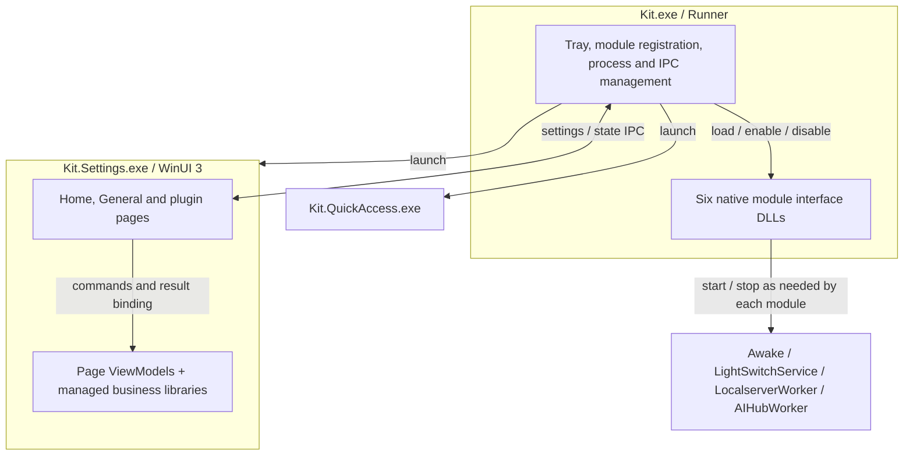
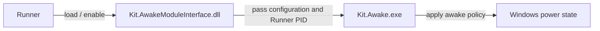
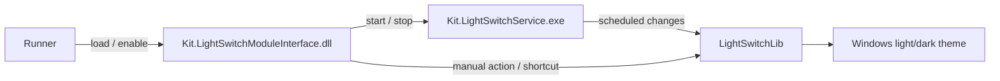
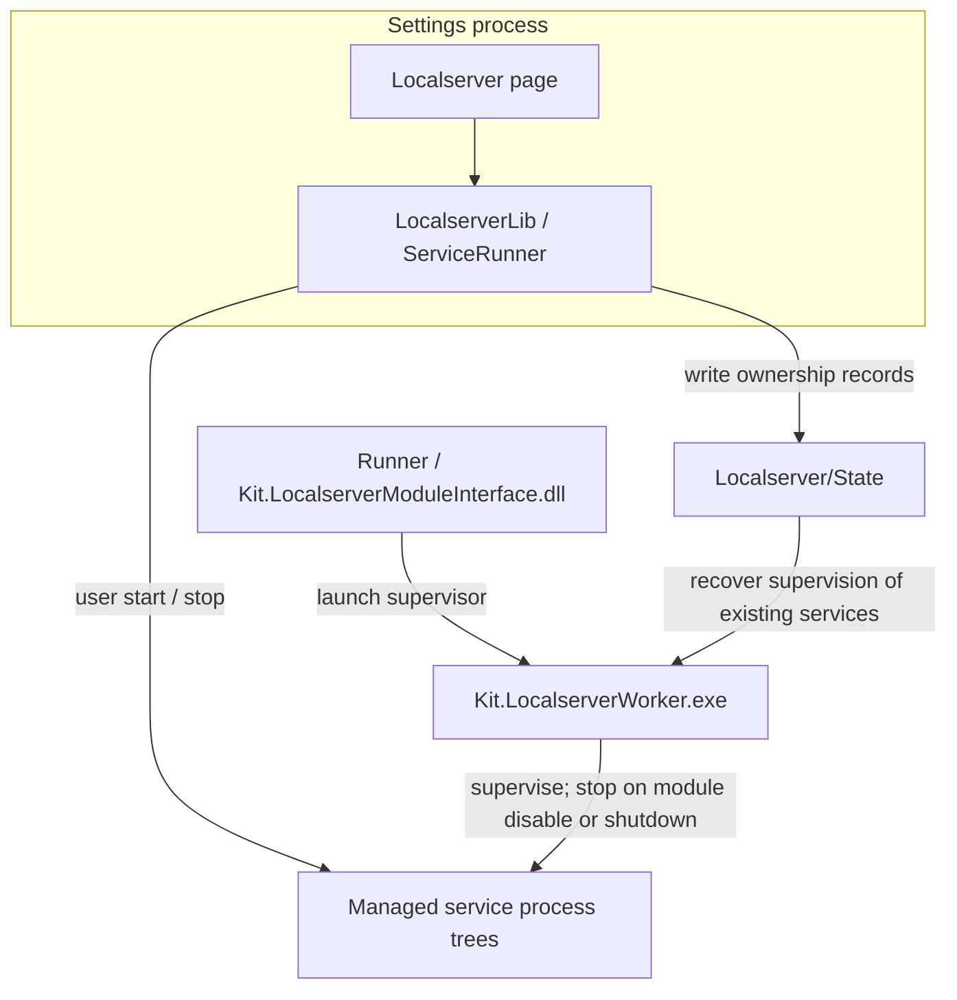
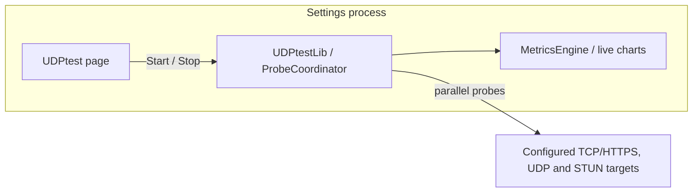
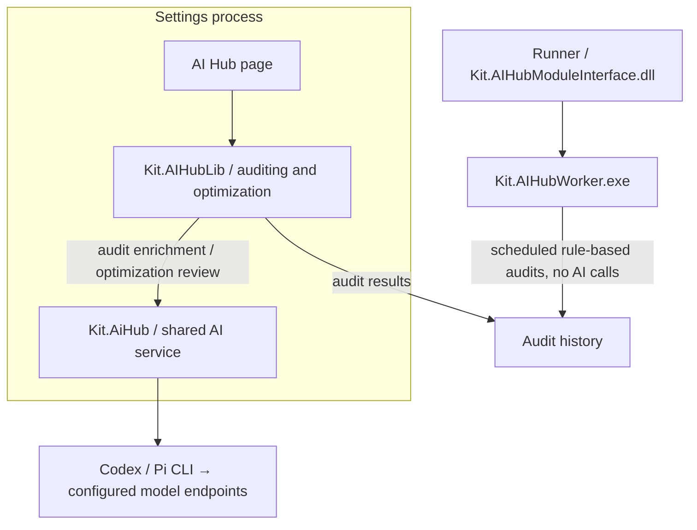
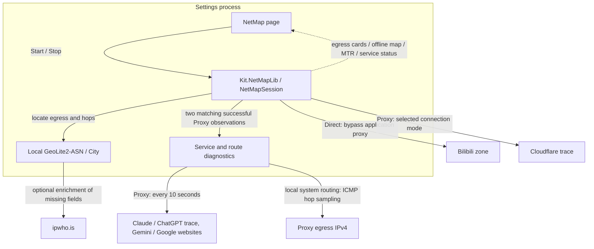

# Kit

**Language / 语言:** English | [中文](README_zh.md)

Kit is a Windows 11 utility collection based on [Microsoft PowerToys](https://github.com/microsoft/PowerToys). It reuses the Runner, native module contract and WinUI 3 Settings framework to bring together system utilities, local service management, network diagnostics and AI-assisted maintenance.

Current source version: **2.3.8**, defined in [src/Version.props](src/Version.props). Kit uses separate configuration, window identity and backup paths to distinguish it from official PowerToys installations. Upstream automatic update and telemetry flows are excluded.

[Overview](#1-overview) · [Framework](#2-framework) · [Plugins](#3-plugins) · [Build and Release](#4-build-and-release) · [Data and Logs](#5-data-and-logs) · [Development](#6-development-and-extension)

## 1. Overview

Kit currently includes six modules. “Plugin” here means a module built and explicitly registered with Kit. Installing third-party plugins by dropping in a DLL or manifest is not supported yet.

| Module | Purpose | Business logic runs in | Origin |
| --- | --- | --- | --- |
| [Awake](#31-awake-keep-the-system-awake) | Keep Windows awake under selected conditions | Separate Awake process | PowerToys |
| [Light Switch](#32-light-switch-theme-scheduling) | Switch light/dark themes on a schedule or manually | Separate Service process | PowerToys |
| [Localserver](#33-localserver-local-service-management) | Configure, start, monitor and stop local services | Settings + supervision Worker | Kit |
| [UDPtest](#34-udptest-configured-line-quality) | Measure configured targets: latency, jitter, success rate and NAT | Settings process | Kit |
| [AI Hub](#35-ai-hub-auditing-and-system-optimization) | Audit system events, organize downloads and clean caches | Settings + scheduled-audit Worker | Kit |
| [NetMap](#36-netmap-current-egress-and-route-observation) | Observe Direct / Proxy egress, service reachability and ICMP routes | Settings process | Kit |

Start `Kit.exe` from the runtime directory, then enable and configure the modules you need in Settings. **Enabling a module and starting its work are separate operations**: Localserver services need individual starts, and NetMap requires Start after enablement.

Home shows system resources and network egress; General contains appearance, startup behavior and shared AI service settings; Quick Access provides shortcuts and module actions. With the tray icon enabled, closing Settings does not exit Kit. Use the tray menu to exit completely.

## 2. Framework

### 2.1 Processes and calls


```mermaid
flowchart TB
    subgraph R["Kit.exe / Runner"]
        HOST["Tray, module registration, process and IPC management"]
        MI["Six native module interface DLLs"]
        HOST -->|"load / enable / disable"| MI
    end
    subgraph S["Kit.Settings.exe / WinUI 3"]
        UI["Home, General and plugin pages"]
        CORE["Page ViewModels + managed business libraries"]
        UI -->|"commands and result binding"| CORE
    end
    HOST -->|"launch"| S
    UI <-->|"settings / state IPC"| HOST
    HOST -->|"launch"| QA["Kit.QuickAccess.exe"]
    MI -->|"start / stop as needed by each module"| W["Awake / LightSwitchService / LocalserverWorker / AIHubWorker"]
```

| Layer | Responsibility | Source |
| --- | --- | --- |
| Runner | Single-instance entry point, tray, module loading, configuration and process shutdown | [src/runner](src/runner) |
| Settings | Configuration and interaction; hosts some modules' running sessions | [Settings.UI](src/settings-ui/Settings.UI) |
| Quick Access | Shortcut panel, module entry points and available actions | [QuickAccess.UI](src/settings-ui/QuickAccess.UI) |
| Native module interfaces | Common enablement, configuration and action contract, loaded in Runner | [modules](src/modules), [kit_module_interface.h](src/modules/interface/kit_module_interface.h) |
| Business libraries and optional Workers | Execute module work; use a Worker / Service when an independent lifetime is needed | Each module directory |
| Shared infrastructure | Logging, settings, interop and AI execution | [src/common](src/common), [Settings.UI.Library](src/settings-ui/Settings.UI.Library) |

Settings sends configuration and module switches over the existing IPC channel. Runner calls the module interfaces and returns their actual enabled state. **Where work runs determines its lifetime**: separate processes can continue after Settings closes, while tasks hosted in Settings depend on that process. Each plugin handles navigation, minimization and stop events according to its own requirements.

### 2.2 Shared AI services versus AI Hub

| Component | Responsibility |
| --- | --- |
| **AI Services** in General | Configure Codex / Pi kernels, Main / Fallback endpoints, models, credentials and policies; `Kit.AiHub` provides execution, cancellation, batching and output validation |
| **AI Hub** plugin page | Organize audits, optimization candidates and user actions; business logic lives in `Kit.AIHubLib` |
| **AIHubWorker** | Run scheduled local rule-based audits and save history, without calling AI kernels |

The shared AI service is an internal Kit library currently consumed by AI Hub. AI analysis in Settings uses external CLI kernels to access the configured endpoints. Fallback must be configured and enabled before it can handle eligible failures. See the [AI service notes](doc/ai-service-review.md) for configuration ownership and known limitations.

### 2.3 Runtime layout

Only the main components are shown. Keep the complete build or staged directory and its dependencies when deploying:

```text
<runtime directory>/
├── Kit.exe
├── Kit.*ModuleInterface.dll
├── Kit.Awake.exe
├── LightSwitchService/Kit.LightSwitchService.exe
├── LocalserverWorker/Kit.LocalserverWorker.exe
├── AIHubWorker/Kit.AIHubWorker.exe
└── WinUI3Apps/
    ├── Kit.Settings.exe
    ├── Kit.QuickAccess.exe
    ├── Kit.AiHub.dll
    ├── Kit.AIHubLib.dll
    ├── LocalserverLib.dll
    ├── UDPtestLib.dll
    └── Kit.NetMapLib.dll
```

## 3. Plugins

### 3.1 Awake: keep the system awake

Keep Windows awake indefinitely, for a set period or under battery-related conditions.


```mermaid
flowchart LR
    R["Runner"] -->|"load / enable"| MI["Kit.AwakeModuleInterface.dll"]
    MI -->|"pass configuration and Runner PID"| A["Kit.Awake.exe"]
    A -->|"apply awake policy"| OS["Windows power state"]
```

- **Runtime**: a separate Awake process applies the policy; disabling the module or exiting Runner ends it.
- **Configuration and details**: `Awake/`; [module documentation](src/modules/awake/README.md).

### 3.2 Light Switch: theme scheduling

Switch Windows light/dark themes by time or sunrise/sunset, with manual actions and shortcuts.


```mermaid
flowchart LR
    R["Runner"] -->|"load / enable"| MI["Kit.LightSwitchModuleInterface.dll"]
    MI -->|"start / stop"| S["Kit.LightSwitchService.exe"]
    S -->|"scheduled changes"| LIB["LightSwitchLib"]
    MI -->|"manual action / shortcut"| LIB
    LIB --> OS["Windows light/dark theme"]
```

- **Runtime**: the Service runs the schedule independently of the Settings window. Disabling the module stops the Service.
- **Configuration and source**: `LightSwitch/`; [module directory](src/modules/LightSwitch).

### 3.3 Localserver: local service management

Manage local programs and services: launch commands, environment, ports, health and process trees.


```mermaid
flowchart TB
    MI["Runner / Kit.LocalserverModuleInterface.dll"] -->|"launch supervisor"| W["Kit.LocalserverWorker.exe"]
    subgraph S["Settings process"]
        PG["Localserver page"] --> LIB["LocalserverLib / ServiceRunner"]
    end
    LIB -->|"user start / stop"| P["Managed service process trees"]
    LIB -->|"write ownership records"| STATE["Localserver/State"]
    STATE -->|"recover supervision of existing services"| W
    W -->|"supervise; stop on module disable or shutdown"| P
```

- **Startup and supervision**: enabling the module does not start the service catalog automatically. Users start services from the page; the Worker adopts them through ownership records without starting duplicates.
- **Lifetime**: navigation pauses UI sampling. Established services can survive Settings closing. Disabling the module or exiting Runner makes the Worker stop its managed services.
- **Scope**: only process trees with verified ownership are managed. Catalog, state and logs live under `Localserver/`. See the [module documentation](src/modules/Localserver/README.md).

### 3.4 UDPtest: configured line quality

Run TCP/HTTPS, UDP Echo, STUN and NAT probes against configured targets, with latency, jitter, success rates and live charts.


```mermaid
flowchart LR
    subgraph S["Settings process"]
        PG["UDPtest page"] -->|"Start / Stop"| ENG["UDPtestLib / ProbeCoordinator"]
        ENG --> METRICS["MetricsEngine / live charts"]
    end
    ENG -->|"parallel probes"| TARGET["Configured TCP/HTTPS, UDP and STUN targets"]
```

- **Runtime**: users control Start / Stop. The engine runs in Settings without a separate Worker.
- **Interpretation**: HTTPS timing measures response-header arrival. NAT behavior, UDP echo and TCP/HTTPS use distinct probes and represent different network measurements.
- **Data**: target configuration is saved under `UDPtest/`; sample history stays in memory. See the [module documentation](src/modules/UDPtest/README.md).

### 3.5 AI Hub: auditing and system optimization

Provides Security Audit, Optimization and task policies, using the shared AI service configured in General.


```mermaid
flowchart TB
    subgraph S["Settings process"]
        PG["AI Hub page"] --> LIB["Kit.AIHubLib / auditing and optimization"]
        LIB -->|"audit enrichment / optimization review"| AI["Kit.AiHub / shared AI service"]
    end
    AI --> CLI["Codex / Pi CLI → configured model endpoints"]
    LIB -->|"audit results"| H["Audit history"]
    MI["Runner / Kit.AIHubModuleInterface.dll"] --> W["Kit.AIHubWorker.exe"]
    W -->|"scheduled rule-based audits, no AI calls"| H
```

- **Security Audit**: collect Windows events and run local rules, with AI enrichment when available. Existing results can also receive deep analysis. AI failures preserve rule-based findings and report the analysis status.
- **Optimization**: local scan of downloads and allowlisted caches → AI review of candidate metadata → user review and confirmation → local execution. Unapproved items cannot enter the executable set. Items are revalidated before execution, and cleanup uses the Recycle Bin.
- **Task lifetime**: audit and optimization can run concurrently and be cancelled separately. Switching tabs preserves work; disabling the module cancels both tasks. Cancellation does not undo completed file operations.
- **Background audits**: the Worker performs scheduled rule-based scans only and exits when scheduling is off. It currently reads its schedule from shared service settings; see the [AI service notes](doc/ai-service-review.md) for differences from page-owned plugin settings.
- **Details**: the [module documentation](src/modules/AIHub/README.md) covers architecture and maintenance; historical validation is recorded in the [changelog](changelog.md).

### 3.6 NetMap: current egress and route observation

Observe the current egress as an external proxy client changes nodes, without importing subscriptions. UDPtest measures configured lines; NetMap shows where traffic currently exits.


```mermaid
flowchart TB
    subgraph S["Settings process"]
        PG["NetMap page"] -->|"Start / Stop"| ENG["Kit.NetMapLib / NetMapSession"]
        ENG -->|"locate egress and hops"| GEO["Local GeoLite2-ASN / City"]
        ENG -->|"two matching successful Proxy observations"| DIAG["Service and route diagnostics"]
    end
    ENG -->|"Direct: bypass application proxy"| D["Bilibili zone"]
    ENG -->|"Proxy: selected connection mode"| P["Cloudflare trace"]
    GEO -->|"optional enrichment of missing fields"| ONLINE["ipwho.is"]
    DIAG -->|"Proxy: every 10 seconds"| WEB["Claude / ChatGPT trace, Gemini / Google websites"]
    DIAG -->|"local system routing: ICMP hop sampling"| MTR["Proxy egress IPv4"]
    ENG -.->|"egress cards / offline map / MTR / service status"| PG
```

- **Start and stop**: enable the module, apply connection settings, then click Start. Navigation and taskbar minimization preserve detection; returning shows the latest results from the same session. Stop, module disablement and hiding/closing Settings stop detection; restarting is manual.
- **Connection modes**: Proxy supports the system proxy, explicit HTTP/HTTPS/SOCKS5, or system routing/TUN. Direct bypasses application proxies only and cannot bypass a system TUN.
- **Map and data**: bundled Natural Earth offline map, with local ASN/City databases taking priority. Optional online enrichment queries public IPs and can be disabled. ASN databases support manual download with hash verification.
- **Diagnostic limits**: service checks establish checkpoint or website reachability, not account or model availability. ICMP follows local system routing and does not reveal the inside of a proxy tunnel.
- **Runtime**: the native `Kit.NetMapModuleInterface.dll` manages enablement and configuration; detection runs in Settings and results remain in memory. See the [module documentation](src/modules/NetMap/README.md) for setup, sources and validation scope.

## 4. Build and Release

### 4.1 Development environment

Use **Windows 11, PowerShell 7, Visual Studio 2026 and the .NET 10 SDK**. The primary build target is **x64**. Install the C++ desktop, .NET desktop and Windows App SDK components listed in [.vsconfig](.vsconfig). Projects target Windows SDK `10.0.26100.0`.

### 4.2 Build and stage

Run from the repository root. The build script initializes the VS environment:

```powershell
# Debug: everyday development
.\tools\build\build.ps1 -Platform x64 -Configuration Debug -Path . /restore /p:BuildTests=false
if ($LASTEXITCODE -ne 0) { throw 'Debug build failed.' }
```

After success, launch `x64/Debug/Kit.exe`. For a Release build and staged runtime directory:

```powershell
.\tools\build\build.ps1 -Platform x64 -Configuration Release -Path . /restore /p:BuildTests=false
if ($LASTEXITCODE -ne 0) { throw 'Release build failed; do not stage incomplete output.' }
.\tools\build\Stage-Release.ps1
```

[Stage-Release.ps1](tools/build/Stage-Release.ps1) reads the version file and creates `bin/release/<version>/` plus a verification manifest, not a ZIP. [Stage-Debug.ps1](tools/build/Stage-Debug.ps1) stages Debug output under `bin/debug/<version>/`. Distribute the whole directory, rather than only `Kit.exe` or a plugin DLL.

### 4.3 Validation and real-machine testing

The commands above skip tests; a successful build is not functional validation. Unit tests live in `*.UnitTests` projects in the source tree and run through VS Test Explorer or `vstest.console.exe`. WinUI and native module checks live in [tools/tests](tools/tests). Read the relevant module documentation and script requirements before running them. Local test output goes to `TestResults/`.

Before testing a new version, exit the old Kit completely from the tray, then launch `Kit.exe` from the new directory. Runner uses a single-instance mechanism, so a running old process can receive the new launch request. To isolate configuration issues, exit Kit and rename `%LOCALAPPDATA%\Kit` as a backup; use fresh settings for the first comparison.

Historical build and regression results are in [changelog.md](changelog.md) and module validation records. They do not certify every real-machine scenario for the current source.

## 5. Data and Logs

The default data root is `%LOCALAPPDATA%\Kit`:

| Relative path | Contents |
| --- | --- |
| `settings.json` | General settings and module switches |
| `<ModuleName>/settings.json` | Module configuration, such as `AIHub/settings.json` and `NetMap/settings.json` |
| `AiHub/service-settings.json` | Shared AI service configuration |
| `AiHub/secrets.dat`, `AiHub/security.md`, `AiHub/chains/` | Encrypted credentials, global and task policies |
| `AiHub/kernels/`, `AiHub/State/` | CLI kernels, audit history and other state |
| `Localserver/services.json`, `Localserver/State/` | Service catalog and process ownership records |
| `NetMap/Data/` | Manually downloaded managed ASN database |
| `RunnerLogs/`, `Settings/Logs/<version>/`, module log directories | Runner, UI and Worker diagnostics |
| `crash.log` | Exception diagnostics |

Windows ignores directory-name casing, so the AI Hub plugin and shared AI service use different filenames: `settings.json` and `service-settings.json`.

If configuration writes are denied and logs fall back to `AppData/LocalLow/Kit`, check the Windows integrity labels of the build output first. Resetting settings does not repair output permissions. See the [AI service notes](doc/ai-service-review.md) for the known case and remediation.

## 6. Development and Extension

Modules retain the PowerToys C++ contract and export `kit_create()`. Core interfaces cover enablement, configuration, actions and destruction. Runner explicitly loads the six modules listed in [KitKnownModules](src/runner/main.cpp).

Adding a module requires:

1. Add the business projects, native module interface and dependencies to `Kit.slnx`. Add a Worker only when independent execution is needed.
2. Register the Runner module list, Settings models and serialization, page navigation and module catalog.
3. Add Home, Quick Access, icons and English/Chinese resources where applicable.
4. Define start/stop, navigation, window-close and Runner-exit behavior; reuse Kit data paths, logging and IPC.
5. Validate core behavior, configuration round trips, registration and lifetime, then run a full build and real-machine checks.

See [src/README.md](src/README.md) for source organization and [PLUGIN_DEVELOPMENT.md](PLUGIN_DEVELOPMENT.md) for the full requirements and template entry points.

## 7. More Documentation

- [Plugin development requirements](PLUGIN_DEVELOPMENT.md): contracts, registration, data isolation, WinUI, localization and lifetime.
- [AI service notes](doc/ai-service-review.md): configuration ownership, execution, known limitations and historical validation.
- [NetMap validation record](src/modules/NetMap/plan.md): data sources, design decisions and test scope.
- [Architecture documentation index](doc/devdoc/README.md): PowerToys architecture, Kit design and development notes; proposed directions are not implemented capabilities.
- [Changelog](changelog.md) · [License](LICENSE).
