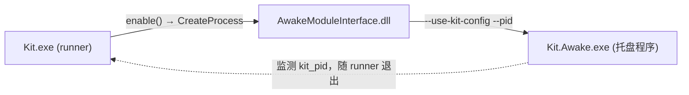
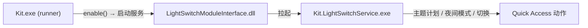
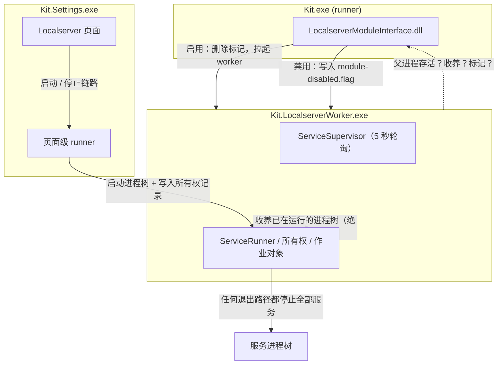
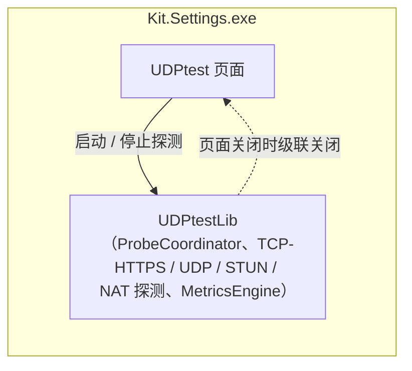
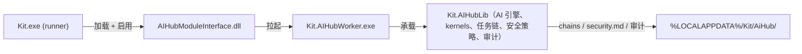

# Kit

**Language / 语言:** [English](README.md) | 中文

---

## 1. Kit 是什么（参考项目）

Kit 是一个基于 **Microsoft PowerToys** 的本地自用 Windows 实用工具工作区。它的存在使得选定的 PowerToys 实用工具可以被修改、隔离，并与同一台机器上安装的官方 PowerToys 构建进行比较。

Kit 是一个**稳定性优先的 PowerToys 衍生工作区，而非完整的产品重新品牌化**：上游的 runner、模块接口、设置与仪表板模式保持可识别，因此导入的 PowerToys 模块可以用最少的适配代码完成验证。

| 保留 | 改变 |
| --- | --- |
| PowerToys runner / 模块接口 / 设置 / 仪表板模式 | 品牌（`Kit`）、窗口标题、可见 UI 文案 |
| `KitModuleIface` C++ 契约（含 `PowertoyModuleIface` 别名） | 设置存储迁移到 `%LOCALAPPDATA%\Kit`（非官方 PowerToys 目录） |
| 显式的模块加载模型 | 移除自动更新、下载与遥测能力 |
| 源自 PowerToys 的模块：`Awake`、`Light Switch`；Kit 自研插件：`Localserver`、`UDPtest`、`AI Hub`、`NetMap` | 备份/恢复默认值使用 Kit 品牌（`%LOCALAPPDATA%\Kit\Backup`、`HKCU\Software\Microsoft\Kit`） |

当前 Kit 版本：`2.3.7`。

---

## 2. Kit 主架构

### 2.1 进程与组件总览

| 组件 | 可执行文件 / 工程 | 职责 |
| --- | --- | --- |
| **Runner（运行器）** | `Kit.exe`（`src/runner`） | 加载模块接口 DLL、管理模块生命周期、承载托盘图标、协调设置 IPC、启动 Settings 与 Quick Access |
| **Settings 应用** | `Kit.Settings.exe`（`src/settings-ui/Settings.UI`，WinUI 3） | Home、General、各模块页面、导航、页面级 ViewModel |
| **Quick Access** | `Kit.QuickAccess.exe`（`src/settings-ui/Settings.UI.Controls`） | 快捷操作 / 仪表板快捷键 |
| **模块接口** | `Kit.<Module>ModuleInterface.dll`（`src/modules/*/...ModuleInterface`，C++） | 加载进 runner 进程，实现 `KitModuleIface` |
| **Worker / Service** | 例如 `Kit.Awake.exe`、`Kit.LightSwitchService.exe`、`Kit.LocalserverWorker.exe`、`Kit.AIHubWorker.exe` | 由模块接口拉起的无头进程，承载各模块引擎，使行为在关闭 Settings 后依然存活 |
| **公共库** | `src/common`（interop WinMD、托管库、`Logger`、设置辅助） | runner、模块、Settings 共享的基础设施 |

`Kit.exe` 旁运行目录布局：

```
<runner dir>/
├── Kit.exe
├── Kit.<Module>ModuleInterface.dll          # 由 runner 加载
├── LocalserverWorker/Kit.LocalserverWorker.exe
├── AIHubWorker/Kit.AIHubWorker.exe
├── Kit.Awake.exe
├── Kit.LightSwitchService.exe
└── WinUI3Apps/
    ├── Kit.Settings.exe
    ├── Kit.QuickAccess.exe
    ├── Kit.NetMapLib.dll                   # NetMap 在 Settings 内运行
    └── modules/NetMap/                     # 第三方许可声明
```

### 2.2 启动与生命周期

1. runner 启动并显示托盘图标，加载和启用模块后，按需打开 Settings。Settings 生命周期线程负责启动 WinUI/.NET 进程和命名管道 IPC；收到的消息转交 runner 主线程处理。
2. runner 加载已知的模块接口 DLL（`src/runner/main.cpp` 中的 `KitKnownModules`），对每个调用 `kit_create()`，并启用设置中打开的模块。
3. Settings 中的启用/禁用沿用 PowerToys 的 `module_status` IPC 消息；runner 应用 GPO 策略并调用模块原生 `enable()` / `disable()` 接口，随后回传 `get_all_settings()`，Settings 用模块实际 `is_enabled()` 状态同步 Utilities。设置文件监听仍作为外部修改的兜底。Kit 不提供 PowerToys 的实验性功能开关及对应策略。
4. 退出：消息循环结束时（托盘退出，或未开启托盘时关闭 Settings），runner 执行模块收尾（`modules().clear()` → `destroy()`），让每个模块在进程退出前清理其 worker 与服务。

### 2.3 模块接口契约（`KitModuleIface`）

定义于 `src/modules/interface/kit_module_interface.h`。模块 DLL 导出 `kit_create()` 返回实现以下方法的对象：

- `get_key()` —— 非本地化模块 ID
- `enable()` / `disable()` / `is_enabled()` —— 生命周期
- `get_config()` / `set_config()` —— 设置 JSON 模式与更新
- `call_custom_action()` —— 自定义 UI 动作
- `get_hotkeys()` / `on_hotkey()` —— 热键注册与分发
- `destroy()` —— 释放全部资源并删除实例（收尾时调用）

### 2.4 通用插件骨架

每个 Kit 模块都遵循相同的五段式骨架：

1. **原生模块接口 DLL**（C++）—— runner 侧契约，随模块启用/禁用。
2. **核心库** —— 引擎本体，托管（`LocalserverLib`、`UDPtestLib`、`AIHubLib`、`NetMapLib`）或原生（`LightSwitchLib`）。
3. **可选的 Worker/Service 可执行文件** —— 在 Settings 进程之外承载引擎的无头进程。
4. **设置页 + ViewModel**（WinUI 3）—— Settings 应用中的模块 UI。
5. **注册点** —— runner `KitKnownModules`、Settings 导航/路由、Home 仪表板元数据、测试。

### 2.5 数据与日志布局

所有运行时数据位于 `%LOCALAPPDATA%\Kit` 下：

| 路径 | 用途 |
| --- | --- |
| `settings.json` | 通用设置 |
| `RunnerLogs\` | runner 日志 |
| `crash.log` | First-chance / 未处理异常日志 |
| `<ModuleKey>\` | 各模块数据：设置、状态、日志、目录（如 `Localserver\services.json`、`Localserver\State\`、`AiHub\chains\`） |
| `<ModuleKey>\Logs\<version>\` | 分版本的模块/worker 日志 |

### 2.6 首页与设置

- **系统概览**：展示设备与 Windows 信息、CPU 负载、内存、运行时间、磁盘空间及可用的 GPU 读数。系统、存储与 GPU 区域统一标签、数值和进度条的列位置；不支持的指标保持不可用状态。
- **网络出口**：使用已保存的 NetMap 设置，对比直连与代理的公网 IP、地区和实际选择的连接方式。保留错误提示，成功时不显示数据采集状态。首页两块概览自动更新，不再显示手动刷新按钮、采集时间及刷新频率底栏。
- **刷新生命周期**：首页可见时，运行时间和 CPU/内存/GPU 动态数据每秒更新，存储每 5 分钟更新，网络出口每 10 秒更新。离开首页或隐藏/最小化 Settings 时暂停计时器并取消页面待处理请求，返回后自动恢复；慢速探测不会产生重叠读取。
- **Mica 与导航**：主框架和概览采用统一的原生 WinUI 色彩、半透明层次及不透明高对比度回退，快捷访问和实用工具保留现有控件。设置页优先展示外观选项，六个紧凑彩色图标按钮按可用宽度换行，可直接跳转对应分组，并保留原生悬停、按下和键盘焦点反馈。

---

## 3. 插件架构骨架解析

六个活动模块分为两类：

- **源自 PowerToys（第一方）**—— `Awake`、`Light Switch`：由上游 PowerToys 模块适配到 Kit 契约。
- **Kit 自研插件** —— `Localserver`、`UDPtest`、`AI Hub`、`NetMap`：为 Kit 本地自用而开发。

### 3.1 Awake —— 保持唤醒



- **骨架**：模块接口 DLL + 独立托盘可执行程序，无进程内引擎。
- **组件**：`AwakeModuleInterface.dll`（C++）→ 以 `--use-kit-config --pid <kit_pid>` 拉起 `Kit.Awake.exe`（`src/modules/awake/Awake`，C# WinExe）。
- **生命周期**：启用模块即拉起托盘程序，按配置模式（不限时 / 定时 / 电池感知）保持系统唤醒；监测 `kit_pid`，runner 退出时自行退出。
- **数据**：`%LOCALAPPDATA%\Kit\Awake\`。

### 3.2 Light Switch —— 定时主题切换



- **骨架**：模块接口 DLL + 原生核心库 + 原生 Service 可执行文件。
- **组件**：`LightSwitchModuleInterface.dll`、`LightSwitchLib`（C++ 核心）、`Kit.LightSwitchService.exe`。
- **生命周期**：启用模块即启动 Service，应用主题计划、夜间模式与切换热键；保留直接的 Quick Access 动作。
- **数据**：`%LOCALAPPDATA%\Kit\LightSwitch\`。

### 3.3 Localserver —— 本地服务编排（最深的骨架）



- **骨架**：模块接口 DLL + 托管核心库 + 无头 worker；Settings 页还承载页面级 runner。
- **组件**：`LocalserverModuleInterface.dll`、`Kit.LocalserverWorker.exe`、`LocalserverLib`（目录存储、`ServiceSupervisor`、`ServiceRunner`、所有权记录、命名作业对象）。
- **生命周期**：
  - 启用模块只让目录可用 —— **绝不自动启动**服务。每个服务（如 Deepseek、Hongguo）由用户在设置页单独开启；worker 只*收养*已在运行的进程树，而不是重新拉起。
  - worker 每 5 秒轮询：父进程是否存活？收养页面新启动的链路？是否存在模块禁用标记？
  - 禁用模块时写入 `module-disabled.flag`；worker 停止全部受管服务并优雅退出（最多 8 秒，超时强制终止）。
  - **任何**退出路径（标记、父进程退出、关闭请求）worker 都会停止全部受管服务，保证不留孤儿进程树。
- **数据**：`%LOCALAPPDATA%\Kit\Localserver\` —— `services.json`（目录）、`State\`（所有权）、`settings.json`、`module-disabled.flag`、`Logs\<version>\`。

### 3.4 UDPtest —— 网络探测引擎



- **骨架**：模块接口 DLL + 托管核心库，**无独立进程** —— 探测引擎在 Settings 页面进程内运行。
- **组件**：`UDPtestModuleInterface.dll`、`UDPtestLib`（`ProbeCoordinator`、TCP-HTTPS / UDP 回显 / STUN / NAT 类型探测、`MetricsEngine`、迷你波形遥测）。
- **生命周期**：页面启动/停止协调式探测，页面关闭时级联关闭；不涉及 worker。
- **数据**：`%LOCALAPPDATA%\Kit\UDPtest\`。

### 3.5 AI Hub —— 统一 AI 服务 + 安全审计



- **骨架**：模块接口 DLL + 托管核心库 + 无头 worker。
- **组件**：`Kit.AIHubModuleInterface.dll`、`Kit.AIHubWorker.exe`、`Kit.AIHubLib`（审计/优化）及 `Kit.AiHub`（共享 AI 引擎、内核、任务链和安全策略）。
- **生命周期**：Worker 执行定时审计；Settings 和 Worker 使用进程内共享 AI 服务及其持久化配置。任务链携带各自的 `AGENTS.md` 策略；安全审计收集 Windows 事件日志、排序发现并执行 AI 分析。
- **数据**：`%LOCALAPPDATA%\Kit\AiHub\` —— `chains\`、`kernels\`、`requests\`、`State\`、`security.md`、`service-settings.json`、`secrets.dat`、`Logs\`。
- **设置界面**：共享 AI 服务（内核、主/备端点、自检、全局安全策略）在“常规”页的 **AI 服务** 分组中配置，卡片样式与其余设置一致。AI Hub 页面包含总开关、AI 就绪状态卡片和三个页签（安全审计 / 系统优化 / 任务策略）；审计操作独立成行、历史统计默认折叠，优化页仅在存在候选项时显示选择统计。严重度颜色随主题切换（浅色 / 深色 / 高对比度）。
- **独立任务**：Security Audit 与 Optimization 可以同时运行，各自保留取消、进度、结果和提示信息；横幅跟随当前标签页，审计进度卡片与侧栏始终显示审计。两个标签页各有“取消任务”按钮，取消只停止后续工作，保留尚未处理的优化候选项，不撤销已完成的文件操作。关闭 AI Hub 会取消两项任务；切换标签页不会中断任务。Optimization 使用本地文件服务，不调用 AI。
- **原生执行**：网络传输和连接重试继续由 Codex/Pi 负责。模型名可自由配置，推理强度提供 `low/high/max`，Kit 原样传入所选的 Main 强度。
- **审计分批**：AI 分析最多选取 400 条事件，优先严重事件和近期事件。每批最多 100 条，编码后的记录数据不超过 96,000 字节；较大的记录会拆成更小的批次。例如 103 条较小记录只需两次原生调用，原先 `max` 默认分批需要七次。等待批次按先后顺序进入执行，并遵守配置的并发上限。
- **长时间回退**：每次 Main 或 Fallback 尝试限 5 分钟，整轮审计限 30 分钟，包含排队时间。主链遇到可恢复的端点错误或单链路超时，Kit 完成清理后尝试一次 Fallback。请在 **常规 → AI 服务** 配置并启用 Fallback，填写端点、模型、凭据和强度；备用为空或关闭时不会启用，也不会自动降低 Main 强度。用户取消、整轮超时、输出校验失败和清理失败不会触发回退。部分批次失败时，保留成功批次已验证的结果，并标明分析不完整。
- **审计诊断**：`%LOCALAPPDATA%\Kit\Settings\Logs\<version>\` 记录分析 ID、批次数、输入字节数、链路/模型/强度、耗时及取消来源；运行时界面显示已完成批次及重试/回退状态。这些诊断不记录端点地址、凭据、提示词或原始响应。原生活动诊断报告开始、推理、生成和 Pi 重试阶段，不记录模型正文，并去除重复阶段通知。Codex/Pi 合成回归覆盖独立请求、取消、超时清理和单任务回退；当前 Release 验证状态见第 4 节。
- **执行隔离**：单请求只按配置的并发数排入批次，避免大审计一次占满队列、阻塞后来的短请求；共享 FIFO 并发上限仍按引擎实例生效，结果保持输入顺序。同步进度回调抛出的异常不再改变任务结果。Pi 在原生传输重试后可接纳完整有效的成功响应，认证、配置和策略错误仍判失败。取消或超时后确认整个 Windows Job 的进程全部退出；超时链路仅在清理成功后允许备用接续，用户取消或清理失败不会触发回退。生产超时预算未改变。

### 3.6 NetMap —— 直连与代理出口观测

NetMap 随外部代理客户端换节点而观察当前出口，不需要导入订阅、绑定代理品牌或维护节点列表。UDPtest 面向已配置线路的质量探测，NetMap 面向当前 Direct 和 Proxy 的实际出口。

- **开始使用**：在设置中打开 NetMap，启用模块，按需选择代理接入方式并应用，再点击同侧的“开始/停止”按钮；左侧指示灯显示采样状态。模块与检测默认均关闭。“停止”、离开页面、隐藏/最小化 Settings 或关闭模块都会停止采样并保留上次内存结果；返回后需手动开始。
- **出口来源**：Direct 不使用应用层代理，读取 [Bilibili zone](https://api.bilibili.com/x/web-interface/zone)；Proxy 读取 [Cloudflare trace](https://1.1.1.1/cdn-cgi/trace) 的 `ip`、`loc`，支持 Windows 系统代理、指定 HTTP/HTTPS/SOCKS5 地址或系统路由/TUN。Direct 无法绕过系统 TUN，Proxy 请求成功也不能单独证明经过代理。
- **地图与 ASN**：内置 Natural Earth v5.1.2 离线地图，使用国家代表点示意地区；优先使用用户自己的 GeoLite2-ASN/City 数据库，缺失字段默认由 ipwho.is 补齐。在线方式会发送待查公网 IP，跳过内网和保留地址并缓存结果，可在设置中关闭。提供 ASN 手动更新入口，从 P3TERX/GeoLite.mmdb 的 GitHub Release 下载，校验发布方 SHA-256 与 MMDB 格式后才替换托管副本，自定义数据库路径始终优先；底图不在线更新。
- **诊断**：连续两次 Proxy 成功且一致后，仅使用 Proxy 每 10 秒检测四个服务：Claude/ChatGPT 的 trace 检查点和 Gemini/Google 网页。结果独立回填，轮次不重叠。校验 trace 并分别展示域名出口；网页检测区分页面响应、登录、浏览器验证及访问受限。通过系统路由持续采样到出口 IP 的 IPv4 ICMP 逐跳结果。没有模型调用，不展示代理隧道内部路径；HTTP 状态码不代表账号或模型可用。
- **状态与延迟**：服务指示灯和 ICMP RTT 按 ≤75 ms 绿色、>75 ms 黄色、错误红色显示，登录、验证或限流响应保持黄色。成功的 Direct/Proxy IP 显示绿色；连续三次失败后不可用的实时值显示 N/A，成功后自动恢复。MTR 平均 RTT/丢包率继续累计，停止时状态灯变灰。颜色适配明暗主题。服务耗时计量 HTTP 响应头，身份观测仍按 Direct 30 秒 / Proxy 5 秒间隔执行。
- **布局**：单行开始/停止栏、带“详情”的紧凑出口卡片；MTR 表格收紧列宽和行距，展示各跳 IP、Loc 地区、丢包率与 RTT，其余宽度优先分给地图。地图按节点经度分布选择中心，中国经美国到新加坡的路径可跨太平洋连续显示；实线连接相邻已定位节点，虚线标示未定位段和出口示意。常驻最近/平均 RTT 与丢包率，采样保留列表滚动和选中项。文案跟随 Kit 的中英文配置。窄窗口卡片上下排列，MTR 表格排到地图下方；合成数据 WinUI 检查中 1200×900 窗口可完整显示地图。
- **组件与数据**：`Kit.NetMapModuleInterface.dll` 处理 Runner 开关和设置，`Kit.NetMapLib.dll` 在 Settings 进程内运行，无 Worker 或 AI 服务依赖。设置保存到 `%LOCALAPPDATA%\Kit\NetMap\settings.json`，观测结果不持久化。
- **验证**：定向 x64 Debug 构建、103 项核心测试、3 项 NetMap 设置测试及中英文实际 WinUI 生命周期/布局检查通过。最新检查覆盖 75 ms 边界、三次失败显示 N/A 与恢复、明暗主题；第 19 跳连续刷新 12 次后滚动和选中项保持不变，异步补齐省市也不跳动。实际 Claude/ChatGPT trace 校验及 Gemini/Google 网页响应通过，本轮网络下四项均超过 75 ms，正确显示黄色。较广的设置/注册回归为 88 项通过、4 项既有失败。实际 GitHub ASN 下载、SHA-256 校验、本地查询及重复更新跳过也已通过；真实代理/PAC/TUN 组合、城市库数据和 Release 验证尚待完成。详见[插件 README](src/modules/NetMap/README.md)与[验收记录](src/modules/NetMap/plan.md)。

## 4. 构建与发布

当前版本为 **2.3.7**。完整 x64 Release 重新构建完成，**0 个错误、63 个警告**。

- **回归**：最终 AI 全套共 312 项，311 项通过，1 项因目录链接创建不可用跳过。首轮一个 Pi 短时限用例失败，原二进制随后定向复测 2/2 通过，完整复测也通过；未调用真实 AI 端点。
- **界面与启动**：中英文 Dashboard、Settings 的明暗主题、窄窗口布局、自动刷新和取消冒烟检查通过，ModulePage 冒烟检查通过。布局截图使用合成中性色背景，不代表桌面 Mica 背景效果。整理后的 `Kit.exe` 实际启动并成功加载全部六个模块，记录的初始化耗时 116 ms 仅为单次观察，不是性能基准。
- **发布目录**：共 1,409 个文件、817,610,935 字节，依赖哈希校验通过。48 个 Kit 自有 EXE/DLL 版本均为 `2.3.7.0`，与 KitSparse 一致。补齐 AI Hub 原生模块 VERSIONINFO；整理脚本不再要求已按构建配置剔除的 `zh-CN` 卫星目录，中文翻译保留在 PRI 资源中并已通过实际运行检查。

重新构建时，在仓库根目录执行，成功后再整理发布目录：

```powershell
.\tools\build\build.ps1 -Platform x64 -Configuration Release -Path . /restore /p:BuildTests=false
if ($LASTEXITCODE -ne 0) { throw 'Build failed; do not stage incomplete output.' }
.\tools\build\Stage-Release.ps1
```

构建后运行 `x64/Release/Kit.exe`；整理后运行 `bin/release/2.3.7/Kit.exe`。整理脚本生成目录，不生成 ZIP。请保留整个运行目录。解决方案中主程序已依赖 AI Hub 模块 DLL 和 Worker，避免 VS 构建主程序时遗漏它们。

要排除旧配置影响，先停止 Localserver 中运行的受管服务，从托盘菜单退出 Kit，再将 `%LOCALAPPDATA%\Kit` 改为不重复的备份名，例如 `Kit.backup-20260930`。启用托盘图标时，Settings 的 X 只关闭设置窗口，Runner 继续运行，与 PowerToys 一致。启动新编译的 Release，首次测试重新填写设置；立即恢复旧 JSON 会失去对照意义。备份保留凭据、策略、下载的内核和历史。不要清理官方 PowerToys 数据或 Localserver 配置指向的外部程序目录。

`%LOCALAPPDATA%\Kit` 内的配置位置：

| 路径 | 内容 |
| --- | --- |
| `settings.json` | 常规设置和模块开关 |
| `AiHub/service-settings.json` | 共享 AI 服务设置 |
| `AIHub/settings.json` | AI Hub 插件设置 |
| `NetMap/settings.json` | 代理接入方式/地址、本地 ASN/城市库路径和在线补齐开关 |
| `AiHub/secrets.dat`、`AiHub/security.md`、`AiHub/chains/` | 加密凭据和策略 |
| `AiHub/kernels/`、`AiHub/State/`、`AiHub/Logs/` | 内核、状态和历史/日志 |
| `Localserver/`、`UDPtest/`、`Awake/`、`LightSwitch/` | 其他模块配置和状态 |

若日志出现拒绝访问并回退到 `%USERPROFILE%\AppData\LocalLow\Kit`，检查 EXE 的 Windows 完整性标签。输出目录继承 **Low Mandatory Level** 会使正常启动的程序缺少写入权限，清空配置无法修复。可对已存在的构建目录执行 `icacls .\x64 /setintegritylevel "(OI)(CI)M"` 恢复正常标签；整理目录 `.\bin` 若也继承该标签，同样处理。这只修改产物标签，不修改配置权限。若在低完整性工作区中删除并重建输出目录，需要重新处理。LocalLow 仅存放回退日志，并非第二套设置。

AI 服务配置现为 `AiHub/service-settings.json`，AI Hub 插件配置为 `AIHub/settings.json`。Windows 不区分目录大小写，因此必须采用不同文件名。有效的旧服务配置自动迁移，无需强制清空。AI 服务仅面向 Kit 内部，目前由 AI Hub 使用；检测与后台配置的后续优化点见 [AI 服务 review](doc/ai-service-review.md)。

- 构建：`tools/build/build.ps1`（单工程）与 `tools/build/build-essentials.ps1`（解决方案还原 + 基础工程）；均自动检测 `x64` 并初始化 VS 环境。
- 版本来源：`src/Version.props`；生成的版本头位于 `src/common/version/Generated Files/version_gen.h`。
- 产物：x64 构建输出到 `x64/<Configuration>/`（`Kit.exe`、`WinUI3Apps\`、模块 DLL、worker）；`tools/build/Stage-Debug.ps1` / `Stage-Release.ps1` 生成暂存的测试/打包目录。
- `x64`、`Debug`、`Release`、`.vs`、`TestResults`、工程 `bin`/`obj` 与根目录 `packages` 均为可丢弃的构建状态，交付后可删除；下次构建会重新生成。

---

## 5. 模块兼容与扩展

Kit 沿用 PowerToys 的模块加载模型，而非另造插件协议。runner 通过 `src/runner/main.cpp` 中维护的 `KitKnownModules` 列表加载已知模块接口 DLL：

- `Kit.AwakeModuleInterface.dll`
- `Kit.LightSwitchModuleInterface.dll`
- `Kit.LocalserverModuleInterface.dll`
- `Kit.UDPtestModuleInterface.dll`
- `Kit.NetMapModuleInterface.dll`
- `Kit.AIHubModuleInterface.dll`

六个模块中，`Awake`、`Light Switch` 来自上游 PowerToys；其余四个（`Localserver`、`UDPtest`、`AI Hub`、`NetMap`）是 Kit 自研插件。固定列表有意为之：避免不稳定的目录探测，让每个模块（无论导入还是自研）都成为一次明确的决策。第三方插件宿主（`plugins/` + `manifest.json`）已规划但尚未实现。

### 导入另一个 PowerToys 模块

1. 复制模块源码，尽量保持上游工程结构。
2. 将工程与构建依赖加入 `Kit.slnx`。
3. 将其接口 DLL 加入 runner 的 `KitKnownModules` 列表。
4. 加入 Settings 导航、路由映射与页面/ViewModel。
5. 保留上游 CsWinRT 引用；从干净的 Release 树构建一次，使 `Kit.Interop` / `Kit.GPOWrapper` 投影重新生成。
6. 仅在实际需要时加入 Home 仪表板元数据与 Quick Access 行为。
7. 为 runner 列表、路由、仪表板与 Quick Access 补充静态/单元覆盖。
8. 先做定向构建验证，再做全解决方案构建。

---

## 6. 稳定方向

- 优先采用上游 PowerToys 模式与小差异，而非新的本地抽象。
- 在 runner/settings/模块兼容稳定之前，保持模块注册显式化。
- 在扩大到全解决方案构建之前，确保 Settings、runner、模块接口、Quick Access 与复制的模块工程可独立构建。
- 保持 Kit 的存储、备份、窗口标题与可见文案与已安装的官方 PowerToys 隔离。
- 不要重新启用自动下载/安装与遥测。
- 保持只供 DSC 使用的 Settings 命令行入口不进入 Kit。
- 不再为活动 Kit 模块集保留仅 AdvancedPaste 的 `LanguageModelProvider` 源码树、AI provider 包 pin、provider UI metadata/helper 或非序列化 AI enum helper。
- Shortcut Conflict 热键查找显式限定为 Quick Access 和 LightSwitch。
- 新模块拆分为可测试的核心库、worker 进程、原生模块接口、设置模型、设置页、Home 元数据与注册测试。

---

## 7. 文档

- [NetMap](src/modules/NetMap/README.md) —— 使用步骤、出口来源、离线地图/ASN 数据、生命周期、构建方法与验证边界。
- [PLUGIN_DEVELOPMENT.md](PLUGIN_DEVELOPMENT.md) —— Kit 插件与模块开发规范：C++ 契约、注册、WinUI 3 + Mica Alt、Logo 规范、数据隔离、生命周期与模板工程。
- `doc/devdoc/kit-architecture.md` —— Kit 架构说明（轻量化插件宿主方向）。
- `doc/devdoc/powertoys-architecture.md` —— 经过工程验证的 PowerToys 框架架构参考（中文）。
- `doc/devdoc/architecture-comparison.md` —— PowerToys 与 Kit 架构对比及启动耗时优化分析（中文）。
- `doc/devdoc/kit-first-plugin.md` —— 首模块落地检查清单与验证基线。
- `doc/devdoc/kit-development-experience.md` —— 第一阶段经验总结与稳定化检查清单。
- `doc/devdoc/startup-optimization-analysis.md` —— 启动耗时优化分析报告（中文）。
- [AI 服务 review](doc/ai-service-review.md) —— 配置归属、已知边界与回归证据；`changelog.md` —— 版本历史。

## 8. 变更记录

完整版本历史见 [changelog.md](changelog.md)。
