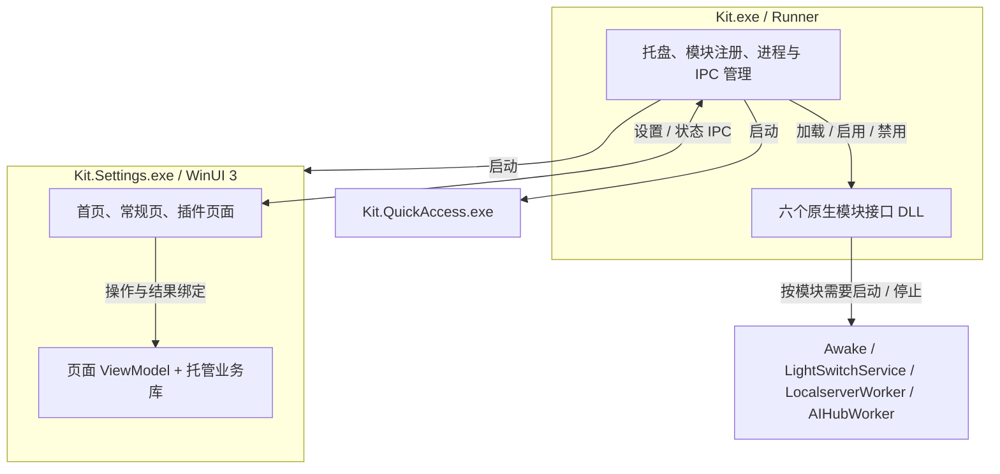
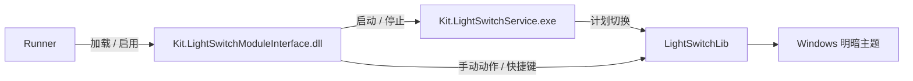
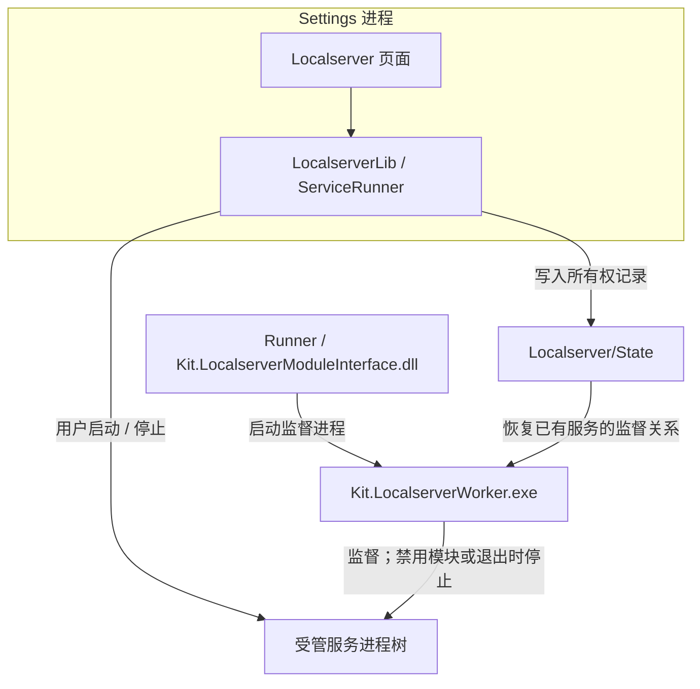
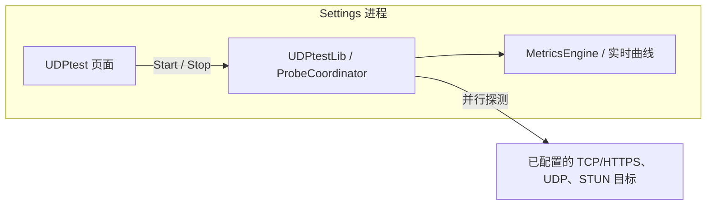
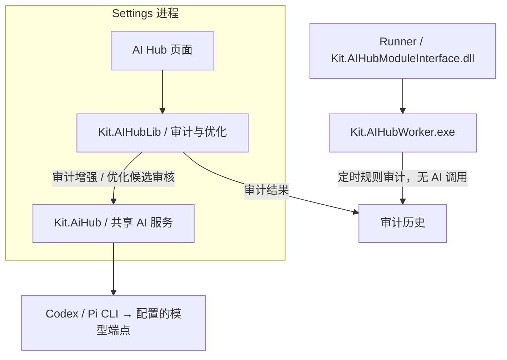
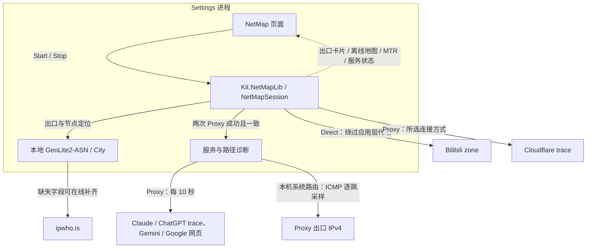

# Kit

**Language / 语言:** [English](README.md) | 中文

Kit 是基于 [Microsoft PowerToys](https://github.com/microsoft/PowerToys) 的 Windows 11 本地工具集。它复用 Runner、原生模块接口和 WinUI 3 设置框架，整合系统工具、本地服务管理、网络诊断与 AI 辅助维护。

当前源码版本：**2.3.8**，以 [src/Version.props](src/Version.props) 为准。Kit 使用独立的配置目录、窗口标识和备份路径，可与官方 PowerToys 区分使用；不包含上游的自动更新与遥测流程。

[功能概览](#1-功能概览) · [主框架](#2-主框架) · [插件](#3-插件) · [构建与发布](#4-构建与发布) · [数据与日志](#5-数据与日志) · [开发与扩展](#6-开发与扩展)

## 1. 功能概览

当前有六个内置模块。本文中的“插件”指随 Kit 编译、显式注册的模块，尚不支持通过放入 DLL 或 manifest 动态安装第三方插件。

| 模块 | 主要用途 | 业务运行位置 | 来源 |
| --- | --- | --- | --- |
| [Awake](#31-awake保持唤醒) | 按条件保持系统唤醒 | 独立 Awake 进程 | PowerToys |
| [Light Switch](#32-light-switch主题切换) | 定时或手动切换明暗主题 | 独立 Service 进程 | PowerToys |
| [Localserver](#33-localserver本地服务管理) | 配置、启动、监控和停止本地服务 | Settings + 监督 Worker | Kit |
| [UDPtest](#34-udptest线路质量探测) | 检测已配置线路的延迟、抖动、成功率及 NAT | Settings 进程 | Kit |
| [AI Hub](#35-ai-hub审计与系统优化) | 系统事件审计、下载整理与缓存清理 | Settings + 定时审计 Worker | Kit |
| [NetMap](#36-netmap当前出口与路径观测) | 观察当前 Direct / Proxy 出口、服务连通性和 ICMP 路径 | Settings 进程 | Kit |

启动运行目录中的 `Kit.exe` 后，在 Settings 中启用需要的模块并配置。**模块开关与任务开始是两层操作**：例如 Localserver 启用后仍需单独启动服务，NetMap 启用后仍需点击 Start。

首页提供系统资源和网络出口概览；常规页管理外观、启动行为和共享 AI 服务；Quick Access 提供快捷入口与模块动作。启用托盘图标时，关闭 Settings 不代表退出 Kit，完整退出使用托盘菜单。

## 2. 主框架

### 2.1 进程与调用关系



| 层次 | 职责 | 源码入口 |
| --- | --- | --- |
| Runner | 单实例入口、托盘、加载模块、协调配置与进程退出 | [src/runner](src/runner) |
| Settings | 配置和交互界面；承载部分模块的运行会话 | [Settings.UI](src/settings-ui/Settings.UI) |
| Quick Access | 快捷面板、模块入口与可用动作 | [QuickAccess.UI](src/settings-ui/QuickAccess.UI) |
| 原生模块接口 | 实现统一启停、配置和动作契约，加载于 Runner | [modules](src/modules)、[kit_module_interface.h](src/modules/interface/kit_module_interface.h) |
| 业务库与可选 Worker | 执行模块业务；需要独立生命周期时使用 Worker / Service | 各模块目录 |
| 公共基础设施 | 日志、设置、互操作、AI 执行能力 | [src/common](src/common)、[Settings.UI.Library](src/settings-ui/Settings.UI.Library) |

Settings 通过现有 IPC 提交设置和模块开关；Runner 调用模块接口并回传实际启用状态。**业务运行位置决定生命周期**：有独立进程的模块可以在 Settings 关闭后继续工作；在 Settings 内运行的任务依赖该进程，各插件自行处理切页、最小化和停止事件。

### 2.2 共享 AI 服务与 AI Hub 的区别

| 组件 | 负责什么 |
| --- | --- |
| **AI Services**（常规页） | 配置 Codex / Pi 内核、Main / Fallback 端点、模型、凭据和策略；由 `Kit.AiHub` 提供执行、取消、分批及结果校验 |
| **AI Hub**（插件页） | 组织系统审计、优化候选项与用户操作；业务位于 `Kit.AIHubLib` |
| **AIHubWorker** | 按计划执行本地规则审计并保存历史，不调用 AI 内核 |

共享 AI 服务是 Kit 内部的库能力，目前由 AI Hub 消费。Settings 中的 AI 分析通过外部 CLI 内核访问所配置的端点；Fallback 需配置并启用才会参与符合条件的失败回退。配置归属及已知限制见 [AI 服务说明](doc/ai-service-review.md)。

### 2.3 运行目录

以下仅列主要组件；部署时保留完整构建或整理目录及其依赖：

```text
<运行目录>/
├── Kit.exe
├── Kit.*ModuleInterface.dll
├── Kit.Awake.exe
├── LightSwitchService/Kit.LightSwitchService.exe
├── LocalserverWorker/Kit.LocalserverWorker.exe
├── AIHubWorker/Kit.AIHubWorker.exe
└── WinUI3Apps/
    ├── Kit.Settings.exe
    ├── Kit.QuickAccess.exe
    ├── Kit.AiHub.dll
    ├── Kit.AIHubLib.dll
    ├── LocalserverLib.dll
    ├── UDPtestLib.dll
    └── Kit.NetMapLib.dll
```

## 3. 插件

### 3.1 Awake：保持唤醒

按不限时、定时或电池相关条件保持系统唤醒。


- **运行方式**：独立 Awake 进程执行唤醒策略；禁用模块或 Runner 退出后结束。
- **配置与说明**：`Awake/`；[模块文档](src/modules/awake/README.md)。

### 3.2 Light Switch：主题切换

按时间或日出日落计划切换 Windows 明暗主题，也支持手动动作和快捷键。



- **运行方式**：Service 执行计划，关闭 Settings 不影响计划；禁用模块会停止 Service。
- **配置与源码**：`LightSwitch/`；[模块目录](src/modules/LightSwitch)。

### 3.3 Localserver：本地服务管理

管理本地程序及服务的启动命令、环境、端口、健康状态和进程树。



- **启动与监督**：启用模块不会自动启动目录中的服务。用户从页面启动，Worker 根据所有权记录接管监督，不重复启动服务。
- **生命周期**：切页暂停界面采样；已启动服务可以在 Settings 关闭后继续运行。禁用模块或退出 Runner 时，Worker 停止受管服务。
- **范围**：仅管理能验证归属的进程树；目录、状态和日志位于 `Localserver/`。详见[模块文档](src/modules/Localserver/README.md)。

### 3.4 UDPtest：线路质量探测

对配置好的目标运行 TCP/HTTPS、UDP Echo、STUN 和 NAT 探测，汇总延迟、抖动、成功率与实时曲线。



- **运行方式**：用户控制 Start / Stop，引擎运行于 Settings 进程，没有独立 Worker。
- **结果含义**：HTTPS 耗时衡量响应头到达时间；NAT 行为、UDP 回显与 TCP/HTTPS 使用各自的探针，不能混作同一种网络指标。
- **数据**：线路配置保存在 `UDPtest/`，采样历史仅保留在内存。详见[模块文档](src/modules/UDPtest/README.md)。

### 3.5 AI Hub：审计与系统优化

提供 Security Audit、Optimization 和任务策略入口，复用常规页配置的共享 AI 服务。



- **安全审计**：收集 Windows 事件并运行本地规则，AI 可用时增强分析；也可对已有结果执行深度分析。AI 失败时保留规则结果并说明分析状态。
- **系统优化**：本地扫描下载文件及白名单缓存 → AI 审核候选元数据 → 用户审查并确认 → 本地执行。未通过审核的条目不进入可执行集合；执行前重新校验，清理使用回收站。
- **任务生命周期**：审计与优化可同时运行，各自取消；切换标签页不中断任务，关闭模块会取消两项任务。取消不撤销已经完成的文件操作。
- **后台审计**：Worker 只执行定时规则扫描；未配置计划时退出。其计划目前读取共享服务配置，和页面插件配置的归属差异见 [AI 服务说明](doc/ai-service-review.md)。
- **详细资料**：[模块文档](src/modules/AIHub/README.md)记录架构与维护细节；历史验证见[变更记录](changelog.md)。

### 3.6 NetMap：当前出口与路径观测

在外部代理客户端切换节点时持续观察当前出口，无需导入订阅。UDPtest 检测“已配置线路的质量”，NetMap 观察“当前实际从哪里出去”。



- **开始与停止**：启用模块、应用连接设置后点击 Start。切换插件或最小化到任务栏时继续检测，返回后显示同一会话的最新结果。Stop、禁用模块、隐藏/关闭 Settings 会停止检测；停止后需手动重新开始。
- **连接方式**：Proxy 支持系统代理、显式 HTTP/HTTPS/SOCKS5 或系统路由/TUN。Direct 只绕过应用层代理，无法绕过系统 TUN。
- **地图与数据**：内置 Natural Earth 离线底图，优先使用本地 ASN/City 数据库；在线补齐会查询公网 IP，可关闭。ASN 数据库支持手动下载及哈希校验。
- **诊断边界**：服务检查反映检查点或网页连通性，不代表账号或模型可用；ICMP 路径经本机系统路由，不是代理隧道内部路径。
- **运行方式**：原生 `Kit.NetMapModuleInterface.dll` 管理开关与配置，检测运行于 Settings，结果仅在内存。使用方法、数据来源与验证范围见[模块文档](src/modules/NetMap/README.md)。

## 4. 构建与发布

### 4.1 开发环境

使用 **Windows 11、PowerShell 7、Visual Studio 2026、.NET 10 SDK**，主要构建目标为 **x64**。VS 需安装 C++ 桌面、.NET 桌面及 Windows App SDK 相关组件；组件清单见 [.vsconfig](.vsconfig)，项目目标 Windows SDK 为 `10.0.26100.0`。

### 4.2 编译与整理

从仓库根目录执行；构建脚本会初始化 VS 环境：

```powershell
# Debug：日常调试
.\tools\build\build.ps1 -Platform x64 -Configuration Debug -Path . /restore /p:BuildTests=false
if ($LASTEXITCODE -ne 0) { throw 'Debug build failed.' }
```

成功后运行 `x64/Debug/Kit.exe`。Release 构建及发布目录整理：

```powershell
.\tools\build\build.ps1 -Platform x64 -Configuration Release -Path . /restore /p:BuildTests=false
if ($LASTEXITCODE -ne 0) { throw 'Release build failed; do not stage incomplete output.' }
.\tools\build\Stage-Release.ps1
```

[Stage-Release.ps1](tools/build/Stage-Release.ps1) 从版本文件取值，生成 `bin/release/<版本>/` 和校验清单，不生成 ZIP。Debug 可用 [Stage-Debug.ps1](tools/build/Stage-Debug.ps1) 整理到 `bin/debug/<版本>/`。需要交付整个目录，不能只复制 `Kit.exe` 或某个插件 DLL。

### 4.3 验证与实机测试

上面的命令跳过测试；编译成功不等于功能验证通过。单元测试位于源码中的 `*.UnitTests` 工程，使用 VS Test Explorer 或 `vstest.console.exe` 运行；WinUI 和原生模块检查位于 [tools/tests](tools/tests)。操作前先阅读对应模块文档及脚本要求，测试输出写入本地 `TestResults/`。

测试新版本前，从托盘彻底退出旧 Kit，再启动新目录中的 `Kit.exe`。Runner 使用单实例机制，旧进程仍在时，新启动请求可能转交旧实例。排查配置影响时，可退出 Kit 后将 `%LOCALAPPDATA%\Kit` 改名备份；首次对照测试先使用新配置。

历史构建与回归记录见 [changelog.md](changelog.md) 和各模块验证文档，不作为当前源码已通过全部实机测试的承诺。

## 5. 数据与日志

默认数据根目录为 `%LOCALAPPDATA%\Kit`：

| 相对路径 | 内容 |
| --- | --- |
| `settings.json` | 常规设置、模块开关 |
| `<模块名>/settings.json` | 模块配置，如 `AIHub/settings.json`、`NetMap/settings.json` |
| `AiHub/service-settings.json` | 共享 AI 服务配置 |
| `AiHub/secrets.dat`、`AiHub/security.md`、`AiHub/chains/` | 加密凭据、全局与任务策略 |
| `AiHub/kernels/`、`AiHub/State/` | CLI 内核、审计历史等状态 |
| `Localserver/services.json`、`Localserver/State/` | 服务目录、进程所有权记录 |
| `NetMap/Data/` | 手动下载的托管 ASN 数据库 |
| `RunnerLogs/`、`Settings/Logs/<version>/`、模块日志目录 | Runner、界面与 Worker 诊断日志 |
| `crash.log` | 异常诊断 |

Windows 不区分目录大小写，因此 AI Hub 插件与共享 AI 服务使用不同文件名：`settings.json` 与 `service-settings.json`。

若出现配置保存被拒绝、日志回退到 `AppData/LocalLow/Kit`，先检查构建产物的 Windows 完整性标签；清空配置不能修复产物权限。已知情况与处理说明见 [AI 服务说明](doc/ai-service-review.md)。

## 6. 开发与扩展

模块沿用 PowerToys 的 C++ 契约，导出 `kit_create()`。核心接口包括启用/禁用、读取/保存配置、快捷动作和销毁；Runner 从 [KitKnownModules](src/runner/main.cpp) 显式加载六个模块。

新增模块需完成：

1. 将业务工程、原生模块接口和依赖加入 `Kit.slnx`；仅在需要独立运行时增加 Worker。
2. 注册 Runner 模块列表、Settings 配置模型与序列化、页面导航和模块目录。
3. 按需接入 Home、Quick Access、图标和中英文资源。
4. 明确启停、切页、窗口关闭及 Runner 退出的行为；复用 Kit 的数据路径、日志和 IPC。
5. 验证核心逻辑、配置往返、注册与生命周期，再进行完整构建和实机检查。

工程组织见 [src/README.md](src/README.md)，完整要求和模板入口见 [PLUGIN_DEVELOPMENT.md](PLUGIN_DEVELOPMENT.md)。

## 7. 更多文档

- [插件开发规范](PLUGIN_DEVELOPMENT.md)：接口、注册、数据隔离、WinUI、本地化与生命周期。
- [AI 服务说明](doc/ai-service-review.md)：配置归属、执行机制、已知限制与历史验证。
- [NetMap 验证记录](src/modules/NetMap/plan.md)：数据来源、设计决策与测试范围。
- [架构资料索引](doc/devdoc/README.md)：PowerToys 架构、Kit 设计和开发经验；设计方向不代表已实现能力。
- [变更记录](changelog.md) · [许可证](LICENSE)。
