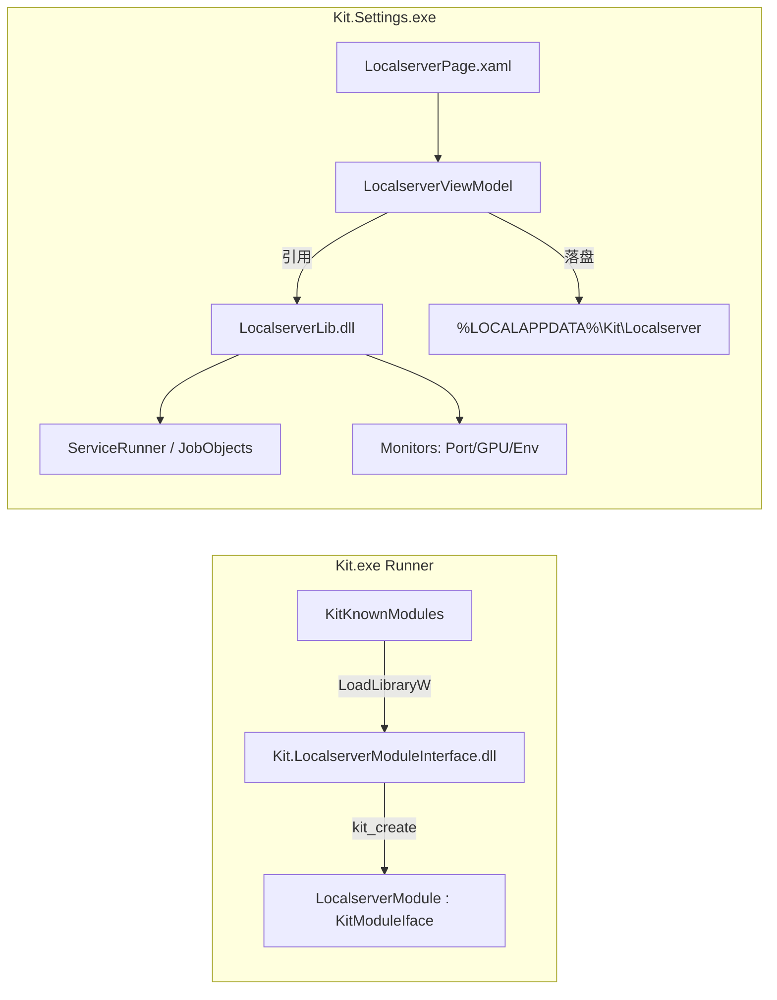
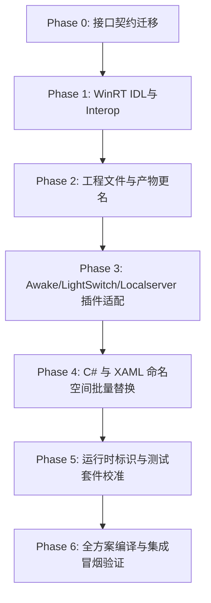

# fixed.md — Kit 全面去 PowerToys 化与插件契约深度重构修正指南

> **2026-09-14 复核说明：** 第 0–10 节保留上一轮方案与代码示例，不能作为当前构建或运行通过的证明。本轮接手时完整构建出现 544 个错误、3 个警告；修复与实际验证记录统一在第 11 节。Localserver 是从独立项目移植的 Kit 插件，Awake 和 LightSwitch 才是本地 PowerToys 快照中的官方模块。

> **生成说明**：本指南基于 `source/PowerToys`（本地只读上游快照，release train 0.101）与 `Kit` 当前代码库（`src/` 及根目录工程）的全量交叉审查结果编制。  
> **核心目标**：  
> 1. 将全仓库所有 `PowerToys`/`powertoy` 残留彻底改为 `Kit`/`kit`（涉及插件契约、WinRT IDL、C# 命名空间、工程名与二进制产物名、OS 级运行时标识、IPC 与协议、GPO 及文档）。  
> 2. 将三大官方模块 **Awake**、**LightSwitch** 与最新的 **Localserver**（及关联类库）从旧版 `PowertoyModuleIface` 接口全量迁移至 `KitModuleIface`，并补全生命周期、命令行参数、进程引导、数据隔离与服务协调逻辑。  
> 3. 提供直接可执行的源码级补丁、项目重命名清单、测试断言校准指南以及分步执行计划。

---

## 目录

- [0. 现状审查与总体架构对照](#0-现状审查与总体架构对照)
- [1. 核心契约改造：Kit 插件接口设计与实现](#1-核心契约改造kit-插件接口设计与实现)
  - [1.1 核心头文件：kit_module_interface.h](#11-核心头文件kit_module_interfaceh)
  - [1.2 Runner 模块加载器改造：kit_module.h 与 kit_module.cpp](#12-runner-模块加载器改造kit_moduleh-与-kit_modulecpp)
  - [1.3 Runner 主控及辅助文件修改点](#13-runner-主控及辅助文件修改点)
- [2. 官方插件 Awake 全量改造（powertoy → kit）](#2-官方插件-awake-全量改造powertoy--kit)
  - [2.1 AwakeModuleInterface（C++ 原生层）](#21-awakemoduleinterfacec-原生层)
  - [2.2 Awake 独立进程宿主（C# 程序集）](#22-awake-独立进程宿主c-程序集)
  - [2.3 Awake.ModuleServices 与单元测试](#23-awakemoduleservices-与单元测试)
- [3. 官方插件 LightSwitch 全量改造（powertoy → kit）](#3-官方插件-lightswitch-全量改造powertoy--kit)
  - [3.1 LightSwitchModuleInterface（C++ 原生层）](#31-lightswitchmoduleinterfacec-原生层)
  - [3.2 LightSwitchService（后台守护服务）](#32-lightswitchservice后台守护服务)
  - [3.3 LightSwitch 测试工程及 UI 测试](#33-lightswitch-测试工程及-ui-测试)
- [4. 最新官方插件 Localserver 深度改造与迁移指南](#4-最新官方插件-localserver-深度改造与迁移指南)
  - [4.1 Localserver 架构定位与组件全景](#41-localserver-架构定位与组件全景)
  - [4.2 LocalserverModuleInterface（C++ 原生层全量源码）](#42-localservermoduleinterfacec-原生层全量源码)
  - [4.3 LocalserverLib（核心托管类库、安全与进程隔离）](#43-localserverlib核心托管类库安全与进程隔离)
  - [4.4 Settings.UI 管理界面与 ViewModel 治理](#44-settingsui-管理界面与-viewmodel-治理)
  - [4.5 Runner 注册、IPC 路由与 Kit.slnx 联动](#45-runner-注册ipc-路由与-kitslnx-联动)
  - [4.6 单元测试 Localserver.cs 与守门断言校准](#46-单元测试-localservercs-与守门断言校准)
  - [4.7 文档与存储路径治理（README.md 纠偏）](#47-文档与存储路径治理readmemd-纠偏)
- [5. WinRT IDL 投影与 Interop / GPOWrapper 彻底改造](#5-winrt-idl-投影与-interop--gpowrapper-彻底改造)
  - [5.1 7 个 IDL 文件重命名与命名空间迁移](#51-7-个-idl-文件重命名与命名空间迁移)
  - [5.2 C++ WinRT 实现文件命名空间调整](#52-c-winrt-实现文件命名空间调整)
  - [5.3 工程文件与产物更名：Kit.Interop 与 Kit.GPOWrapper](#53-工程文件与产物更名kitinterop-与-kitgpowrapper)
- [6. C# 命名空间、XAML 与工程文件全面重构](#6-c-命名空间xaml-与工程文件全面重构)
  - [6.1 22 个项目工程更名及属性对照表](#61-22-个项目工程更名及属性对照表)
  - [6.2 C# 命名空间全量替换规则](#62-c-命名空间全量替换规则)
  - [6.3 XAML 标记与资源字典引用修正](#63-xaml-标记与资源字典引用修正)
  - [6.4 关键反射与运行时字符串修正（防崩必修）](#64-关键反射与运行时字符串修正防崩必修)
- [7. 运行时系统标识、IPC、通知与 GPO 治理](#7-运行时系统标识ipc通知与-gpo-治理)
  - [7.1 IPC 与设置数据格式（kit_version / kit 键）](#71-ipc-与设置数据格式kit_version--kit-键)
  - [7.2 Windows Toast 通知与 Background Activator](#72-windows-toast-通知与-background-activator)
  - [7.3 GPO 模板文件与组策略键值](#73-gpo-模板文件与组策略键值)
  - [7.4 协议、注册表与安装兼容层决策](#74-协议注册表与安装兼容层决策)
- [8. 守门测试套件同步校准（保证全绿通过）](#8-守门测试套件同步校准保证全绿通过)
  - [8.1 BuildCompatibility.cs 关键断言更新](#81-buildcompatibilitycs-关键断言更新)
  - [8.2 General.cs 与 Localserver.cs 断言更新](#82-generalcs-与-localservercs-断言更新)
- [9. 文档、模板与解决方案统一](#9-文档模板与解决方案统一)
- [10. 分步实施计划与验证方案（Phase 0 ~ Phase 6）](#10-分步实施计划与验证方案phase-0--phase-6)

---

## 0. 现状审查与总体架构对照

在对 `source/PowerToys` 和 `Kit` 进行逐文件、逐符号比对后，梳理出当前的残留分布与关键差异：

1. **接口契约现状**：
   - 当前 Kit 仍使用 `powertoy_module_interface.h`，导出函数仍为 `powertoy_create()`，核心基类为 `PowertoyModuleIface`。
   - Runner 中的模块管理器仍以 `PowertoyModule`、`load_powertoy()`、`start_enabled_powertoys()` 命名。
   - 本次改造将**确立全新的 Kit 原生模块契约**：`KitModuleIface` 与 `kit_create()`，所有三大官方插件（Awake、LightSwitch、Localserver）必须全量适配。
2. **Awake 插件现状**：
   - 源码已全量引入 Kit。与上游相比，删除了 5 个 `ManagedTelemetry` 遥测事件文件（符合 Kit 无遥测隐私规范）。
   - 进程生命周期已由 Kit 进行强化（退出事件监听、句柄超时清理、进程强制终止保护）。
   - **残留缺陷**：`AwakeModuleInterface/dllmain.cpp` 仍导出 `powertoy_create`，引导参数仍使用 `--use-pt-config`，启动进程硬编码为 `PowerToys.Awake.exe`，GPO/SettingsAPI 仍绑定 `PowerToysSettings::` 与 `powertoys_gpo::`。
3. **LightSwitch 插件现状**：
   - 源码文件集合与上游一致，且 Kit 已完成了大量的多线程/多进程健壮性改造（本地 GUID 隔离事件、防抖线程安全 join、生命周期互斥锁、系统/应用主题独立原子状态）。
   - 上游有但 Kit 刻意裁减的功能：上游在 `dllmain.cpp` 中提供了 `forceLight`/`forceDark` 自定义按钮动作以及 `toggle-theme-hotkey` 主题切换热键；Kit 删减了这部分并简化了 IPC。
   - **残留缺陷**：`LightSwitchModuleInterface/dllmain.cpp` 仍导出 `powertoy_create`，启动后台服务硬编码为 `PowerToys.LightSwitchService.exe`，服务名与产物名仍为 `PowerToys.LightSwitchService`。
4. **Localserver 最新插件现状**：
   - `Localserver` 是 Kit 内部面向 Windows 11 的本地微服务与环境监控中心，源自独立应用 LocalServerHub。
   - 由 C++ 接口 DLL（`LocalserverModuleInterface`）、核心托管业务类库（`LocalserverLib`）与 Settings 界面（`LocalserverPage.xaml` / `LocalserverViewModel.cs`）构成。
   - **残留缺陷**：原生层仍实现 `PowertoyModuleIface`、导出 `powertoy_create()`、编译产物仍为 `PowerToys.LocalserverModuleInterface.dll`；Settings/ViewModel 命名空间依然声明为 `Microsoft.PowerToys.*`；`README.md` 中甚至留有 `%LOCALAPPDATA%\Microsoft\PowerToys\Localserver` 错误路径（代码实际已是 `Kit\Localserver`）。
5. **WinRT 投影与 C# 层现状**：
   - 7 个 IDL 文件依然声明 `namespace PowerToys.Interop` 和 `namespace PowerToys.GPOWrapper`。
   - 约 353 处 C# 命名空间仍使用 `Microsoft.PowerToys.*`，340 多个源码及 XAML 文件包含历史品牌引用。
   - `Settings.UI` 核心导航中使用反射 `assembly.GetType($"Microsoft.PowerToys.Settings.UI.Views.{pageTypeName}")`，若改了命名空间而不改此处，设置界面将发生崩溃。
6. **守门测试现状**：
   - `src/settings-ui/Settings.UI.UnitTests/ViewModelTests/BuildCompatibility.cs` 与 `Localserver.cs` 拥有严格断言，锁定了方案文件、模块 DLL 名、URI 协议等；必须与代码改造原子同步，否则无法通过 CI 构建。

---

## 1. 核心契约改造：Kit 插件接口设计与实现

### 1.1 核心头文件：kit_module_interface.h

创建新文件 `src/modules/interface/kit_module_interface.h`（并删除旧的 `powertoy_module_interface.h`，或保留重定向宏以供过渡）。

```cpp
#pragma once

#include <compare>
#include <optional>
#include <string>
#include <Windows.h>
#include <common/utils/gpo.h>

/*
  DLL Interface for Kit. The kit_create() (see below) must return
  an object that implements this interface.

  The Kit runner will, for each Kit module DLL:
    - load the DLL,
    - call kit_create() to create the Kit module.

  On the received object, the runner will call:
    - get_key() to get the non-localized ID of the module,
    - enable() to initialize the module,
    - get_hotkeys() / GetHotkeyEx() to register the hotkeys that the module uses.

  While running, the runner might call the following methods between kit_create()
  and destroy():
    - disable() / enable() / is_enabled() to change or query enabled state,
    - get_config() to get the available configuration settings JSON schema,
    - set_config() to update settings values,
    - call_custom_action() when a UI custom action is triggered,
    - get_hotkeys() when settings change to update hotkey registration,
    - on_hotkey() / OnHotkeyEx() when the registered hotkey is triggered.

  When terminating, the runner will:
    - call destroy() which must free all resources and delete the module instance,
    - unload the DLL.
*/

class KitModuleIface
{
public:
    /* Describes a hotkey which can trigger an action in the Kit module */
    struct Hotkey
    {
        bool win = false;
        bool ctrl = false;
        bool shift = false;
        bool alt = false;
        unsigned char key = 0;
        int id = 0;
        bool isShown = true;

        std::strong_ordering operator<=>(const Hotkey& other) const
        {
            if (auto cmp = (win <=> other.win); cmp != 0) return cmp;
            if (auto cmp = (ctrl <=> other.ctrl); cmp != 0) return cmp;
            if (auto cmp = (shift <=> other.shift); cmp != 0) return cmp;
            if (auto cmp = (alt <=> other.alt); cmp != 0) return cmp;
            return key <=> other.key;
        }

        bool operator==(const Hotkey& other) const
        {
            return win == other.win &&
                   ctrl == other.ctrl &&
                   shift == other.shift &&
                   alt == other.alt &&
                   key == other.key;
        }
    };

    struct HotkeyEx
    {
        WORD modifiersMask = 0;
        WORD vkCode = 0;
        int id = 0;
    };

    /* Returns the localized name of the module */
    virtual const wchar_t* get_name() = 0;

    /* Returns non-localized unique key of the module (e.g. L"Awake", L"LightSwitch", L"Localserver") */
    virtual const wchar_t* get_key() = 0;

    /* Fills a buffer with the available configuration settings JSON */
    virtual bool get_config(wchar_t* buffer, int* buffer_size) = 0;

    /* Sets the configuration values from JSON */
    virtual void set_config(const wchar_t* config) = 0;

    /* Call custom action from settings UI */
    virtual void call_custom_action(const wchar_t* /*action*/) {}

    /* Enables the module */
    virtual void enable() = 0;

    /* Disables the module, releasing background resources */
    virtual void disable() = 0;

    /* Returns true if the module is enabled */
    virtual bool is_enabled() = 0;

    /* Destroy the module and free all memory */
    virtual void destroy() = 0;

    /* Get the list of traditional hotkeys */
    virtual size_t get_hotkeys(Hotkey* /*buffer*/, size_t /*buffer_size*/)
    {
        return 0;
    }

    /* Modern HotkeyEx interface */
    virtual std::optional<HotkeyEx> GetHotkeyEx()
    {
        return std::nullopt;
    }

    virtual void OnHotkeyEx()
    {
    }

    /* Called when one of the registered hotkeys is pressed. Returns true if key is swallowed */
    virtual bool on_hotkey(size_t /*hotkeyId*/)
    {
        return false;
    }

    virtual void send_settings_telemetry()
    {
    }

    virtual bool is_enabled_by_default() const { return true; }

    /* Provides the GPO configuration value for the module */
    virtual kit_gpo::gpo_rule_configured_t gpo_policy_enabled_configuration()
    {
        return kit_gpo::gpo_rule_configured_not_configured;
    }

    const static inline ULONG_PTR CENTRALIZED_KEYBOARD_HOOK_DONT_TRIGGER_FLAG = 0x110;

protected:
    HANDLE CreateDefaultEvent(const wchar_t* eventName)
    {
        SECURITY_ATTRIBUTES sa;
        sa.nLength = sizeof(sa);
        sa.bInheritHandle = false;
        sa.lpSecurityDescriptor = NULL;
        return CreateEventW(&sa, FALSE, FALSE, eventName);
    }
};

/*
  Typedef of the factory function that creates the Kit module object.
  Must be exported by the DLL as kit_create(), e.g.:

  extern "C" __declspec(dllexport) KitModuleIface* __cdecl kit_create();
*/
typedef KitModuleIface*(__cdecl* kit_create_func)();

// 兼容过渡类型与别名（供平滑迁移过渡使用）
using PowertoyModuleIface = KitModuleIface;
typedef kit_create_func powertoy_create_func;
```

---

### 1.2 Runner 模块加载器改造：kit_module.h 与 kit_module.cpp

将 `src/runner/powertoy_module.h` 和 `powertoy_module.cpp` 重命名并重写为 `kit_module.h` 与 `kit_module.cpp`。

#### `src/runner/kit_module.h`
```cpp
#pragma once
#include <interface/kit_module_interface.h>
#include <string>
#include <memory>
#include <mutex>
#include <vector>
#include <functional>
#include <map>
#include "hotkey_conflict_detector.h"
#include <common/utils/json.h>

struct KitModuleDeleter
{
    void operator()(KitModuleIface* module_ptr) const
    {
        if (module_ptr)
        {
            module_ptr->destroy();
        }
    }
};

struct KitModuleDLLDeleter
{
    using pointer = HMODULE;
    void operator()(HMODULE handle) const
    {
        FreeLibrary(handle);
    }
};

class KitModule
{
public:
    KitModule(KitModuleIface* module_ptr, HMODULE handle);

    inline KitModuleIface* operator->()
    {
        return kit_module.get();
    }

    json::JsonObject json_config() const;
    void update_hotkeys();
    void UpdateHotkeyEx();

    inline void remove_hotkey_records()
    {
        hkmng.RemoveHotkeyByModule(kit_module->get_key());
    }

private:
    HotkeyConflictDetector::HotkeyConflictManager& hkmng;
    std::unique_ptr<HMODULE, KitModuleDLLDeleter> handle;
    std::unique_ptr<KitModuleIface, KitModuleDeleter> kit_module;
};

std::map<std::wstring, KitModule>& modules();
KitModule load_kit_module(const std::wstring_view filename);

// 兼容别名
using PowertoyModule = KitModule;
```

#### `src/runner/kit_module.cpp`
```cpp
#include "pch.h"
#include "kit_module.h"
#include "centralized_kb_hook.h"
#include "centralized_hotkeys.h"
#include <common/logger/logger.h>
#include <common/utils/winapi_error.h>

std::map<std::wstring, KitModule>& modules()
{
    static std::map<std::wstring, KitModule> modules_map;
    return modules_map;
}

KitModule load_kit_module(const std::wstring_view filename)
{
    auto handle = winrt::check_pointer(LoadLibraryW(filename.data()));
    
    // 优先寻找 kit_create 导出，向后兼容 fallback 到 powertoy_create
    auto create = reinterpret_cast<kit_create_func>(GetProcAddress(handle, "kit_create"));
    if (!create)
    {
        create = reinterpret_cast<kit_create_func>(GetProcAddress(handle, "powertoy_create"));
    }

    if (!create)
    {
        FreeLibrary(handle);
        winrt::throw_last_error();
    }

    auto module_ptr = create();
    if (!module_ptr)
    {
        FreeLibrary(handle);
        winrt::throw_hresult(winrt::hresult(E_POINTER));
    }
    return KitModule(module_ptr, handle);
}

json::JsonObject KitModule::json_config() const
{
    int size = 0;
    kit_module->get_config(nullptr, &size);
    std::wstring result;
    if (size > 1)
    {
        result.resize(static_cast<size_t>(size) - 1);
        kit_module->get_config(result.data(), &size);
        return json::JsonObject::Parse(result);
    }
    return json::JsonObject();
}

KitModule::KitModule(KitModuleIface* module_ptr, HMODULE handle) :
    handle(handle), kit_module(module_ptr), hkmng(HotkeyConflictDetector::HotkeyConflictManager::GetInstance())
{
    if (!kit_module)
    {
        throw std::runtime_error("Kit module not initialized");
    }

    remove_hotkey_records();
    update_hotkeys();
    UpdateHotkeyEx();
}

void KitModule::update_hotkeys()
{
    CentralizedKeyboardHook::ClearModuleHotkeys(kit_module->get_key());

    size_t hotkeyCount = kit_module->get_hotkeys(nullptr, 0);
    std::vector<KitModuleIface::Hotkey> hotkeys(hotkeyCount);
    kit_module->get_hotkeys(hotkeys.data(), hotkeyCount);

    auto modulePtr = kit_module.get();

    for (size_t i = 0; i < hotkeyCount; i++)
    {
        if (hotkeys[i].isShown)
        {
            hkmng.AddHotkey(hotkeys[i], kit_module->get_key(), static_cast<int>(i), kit_module->is_enabled());

            CentralizedKeyboardHook::SetHotkeyAction(kit_module->get_key(), hotkeys[i], [modulePtr, i] {
                Logger::trace(L"{} hotkey is invoked from Centralized keyboard hook", modulePtr->get_key());
                return modulePtr->on_hotkey(i);
            });
        }
    }
}

void KitModule::UpdateHotkeyEx()
{
    CentralizedHotkeys::UnregisterHotkeysForModule(kit_module->get_key());

    auto container = kit_module->GetHotkeyEx();
    if (container.has_value() && kit_module->is_enabled())
    {
        hkmng.RemoveHotkeyByModule(kit_module->get_key());

        auto hotkey = container.value();
        auto modulePtr = kit_module.get();
        auto action = [modulePtr](WORD /*modifiersMask*/, WORD /*vkCode*/) {
            Logger::trace(L"{} hotkey Ex is invoked from Centralized keyboard hook", modulePtr->get_key());
            modulePtr->OnHotkeyEx();
        };

        HotkeyConflictDetector::Hotkey _hotkey = HotkeyConflictDetector::ShortcutToHotkey({ hotkey.modifiersMask, hotkey.vkCode });
        hkmng.AddHotkey(_hotkey, kit_module->get_key(), 0, kit_module->is_enabled());

        CentralizedHotkeys::AddHotkeyAction({ hotkey.modifiersMask, hotkey.vkCode }, { kit_module->get_key(), action });
    }
}
```

---

### 1.3 Runner 主控及辅助文件修改点

1. **`src/runner/Kit.vcxproj`**:
   - 将 `powertoy_module.h` 与 `powertoy_module.cpp` 替换为 `kit_module.h` 与 `kit_module.cpp`。
2. **`src/runner/main.cpp`**:
   - `KitKnownModules` 清单更新：
     ```cpp
     constexpr std::wstring_view KitKnownModules[] = {
         L"Kit.AwakeModuleInterface.dll",
         L"Kit.LightSwitchModuleInterface.dll",
         L"Kit.LocalserverModuleInterface.dll",
     };
     ```
   - 模块加载调用更新：
     ```cpp
     for (auto moduleSubdir : KitKnownModules)
     {
         try
         {
             auto module_inst = load_kit_module(moduleSubdir);
             modules().emplace(module_inst->get_key(), std::move(module_inst));
             Logger::info(L"STARTUP_TIMING: Module Loaded: {}", moduleSubdir);
         }
         catch (...) { ... }
     }
     start_enabled_kit_modules(startupGeneralSettings);
     ```
   - 全局日志文案替换：`"Running powertoys with cmd args"` → `"Running Kit with cmd args"`，`"PowerToys exits here"` → `"Kit exits here"`。
3. **`src/runner/general_settings.h` 与 `general_settings.cpp`**:
   - 函数名 `start_enabled_powertoys()` 重命名为 `start_enabled_kit_modules()`。
   - `powertoys_version` 键名改为 `kit_version`。
   - 变量 `powertoy` 改为 `kit_module`，`powertoys_to_disable` 改为 `modules_to_disable`。
4. **`src/runner/centralized_kb_hook.h` & `hotkey_conflict_detector.h`**:
   - include `<interface/kit_module_interface.h>`，使用 `KitModuleIface::Hotkey` 和 `KitModuleIface::HotkeyEx`。

---

## 2. 官方插件 Awake 全量改造（powertoy → kit）

### 2.1 AwakeModuleInterface（C++ 原生层）

#### `src/modules/awake/AwakeModuleInterface/dllmain.cpp`
将原有的 `PowertoyModuleIface` 与 `powertoy_create` 全面换装为 `KitModuleIface` 与 `kit_create`：

```cpp
#include "pch.h"
#include <interface/kit_module_interface.h>
#include <common/SettingsAPI/settings_objects.h>
#include <common/interop/shared_constants.h>
#include "trace.h"
#include "resource.h"
#include "AwakeConstants.h"
#include <common/logger/logger.h>
#include <common/SettingsAPI/settings_helpers.h>
#include <common/utils/elevation.h>
#include <common/utils/process_path.h>
#include <common/utils/resources.h>
#include <common/utils/os-detect.h>
#include <common/utils/winapi_error.h>
#include <filesystem>
#include <set>

BOOL APIENTRY DllMain(HMODULE /*hModule*/, DWORD ul_reason_for_call, LPVOID /*lpReserved*/)
{
    switch (ul_reason_for_call)
    {
    case DLL_PROCESS_ATTACH:
        Trace::RegisterProvider();
        break;
    case DLL_THREAD_ATTACH:
    case DLL_THREAD_DETACH:
        break;
    case DLL_PROCESS_DETACH:
        Trace::UnregisterProvider();
        break;
    }
    return TRUE;
}

const static wchar_t* MODULE_NAME = L"Awake";
const static wchar_t* MODULE_DESC = L"A module that keeps your computer awake on-demand.";
constexpr DWORD AWAKE_SHUTDOWN_WAIT_MS = 1500;

class Awake : public KitModuleIface
{
    std::wstring app_name;
    std::wstring app_key;

private:
    bool m_enabled = false;
    PROCESS_INFORMATION p_info = {};

    bool is_process_running()
    {
        return p_info.hProcess && WaitForSingleObject(p_info.hProcess, 0) == WAIT_TIMEOUT;
    }

    void close_process_handles()
    {
        if (p_info.hThread)
        {
            CloseHandle(p_info.hThread);
            p_info.hThread = nullptr;
        }

        if (p_info.hProcess)
        {
            CloseHandle(p_info.hProcess);
            p_info.hProcess = nullptr;
        }

        p_info.dwProcessId = 0;
        p_info.dwThreadId = 0;
    }

    void terminate_process_if_running()
    {
        if (!is_process_running())
        {
            return;
        }

        Logger::warn(L"Kit Awake did not exit after shutdown signal; terminating process.");
        if (!TerminateProcess(p_info.hProcess, 1))
        {
            Logger::warn(L"Failed to terminate Kit Awake. {}", get_last_error_or_default(GetLastError()));
            return;
        }

        WaitForSingleObject(p_info.hProcess, AWAKE_SHUTDOWN_WAIT_MS);
    }

    void wait_for_process_shutdown()
    {
        if (!p_info.hProcess)
        {
            return;
        }

        DWORD waitResult = WaitForSingleObject(p_info.hProcess, AWAKE_SHUTDOWN_WAIT_MS);
        if (waitResult == WAIT_TIMEOUT || waitResult == WAIT_FAILED)
        {
            terminate_process_if_running();
        }
    }

    bool launch_process()
    {
        Logger::trace(L"Launching Kit Awake process");
        unsigned long kit_pid = GetCurrentProcessId();

        std::wstring executable_args = L"--use-kit-config --pid " + std::to_wstring(kit_pid);
        std::wstring application_path = L"Kit.Awake.exe";
        std::wstring full_command_path = application_path + L" " + executable_args.data();
        Logger::trace(L"Kit Awake launching with parameters: " + executable_args);

        STARTUPINFO info = { sizeof(info) };

        if (!CreateProcess(application_path.c_str(), full_command_path.data(), NULL, NULL, true, NULL, NULL, NULL, &info, &p_info))
        {
            DWORD error = GetLastError();
            std::wstring message = L"Kit Awake failed to start with error: " + std::to_wstring(error);
            Logger::error(message);
            close_process_handles();
            return false;
        }

        return true;
    }

public:
    Awake()
    {
        app_name = GET_RESOURCE_STRING(IDS_AWAKE_NAME);
        app_key = AwakeConstants::ModuleKey;
        std::filesystem::path logFilePath(PTSettingsHelper::get_module_save_folder_location(this->app_key));
        logFilePath.append(LogSettings::awakeLogPath);
        Logger::init(LogSettings::awakeLoggerName, logFilePath.wstring(), PTSettingsHelper::get_log_settings_file_location());
        Logger::info("Awake module is constructing");
    };

    virtual kit_gpo::gpo_rule_configured_t gpo_policy_enabled_configuration() override
    {
        return kit_gpo::getConfiguredAwakeEnabledValue();
    }

    virtual void destroy() override
    {
        disable();
        delete this;
    }

    virtual const wchar_t* get_name() override
    {
        return MODULE_NAME;
    }

    virtual bool get_config(wchar_t* buffer, int* buffer_size) override
    {
        HINSTANCE hinstance = reinterpret_cast<HINSTANCE>(&__ImageBase);
        KitSettings::Settings settings(hinstance, get_name());
        settings.set_description(MODULE_DESC);
        return settings.serialize_to_buffer(buffer, buffer_size);
    }

    virtual const wchar_t* get_key() override
    {
        return app_key.c_str();
    }

    virtual void set_config(const wchar_t* config) override
    {
        try
        {
            KitSettings::PowerToyValues values =
                KitSettings::PowerToyValues::from_json_string(config, get_key());
            values.save_to_settings_file();
        }
        catch (std::exception&)
        {
        }
    }

    virtual void enable() override
    {
        if (m_enabled && is_process_running())
        {
            return;
        }

        close_process_handles();
        if (launch_process())
        {
            m_enabled = true;
            Trace::EnableAwake(true);
        }
    }

    virtual void disable() override
    {
        if (m_enabled || p_info.hProcess)
        {
            Trace::EnableAwake(false);
            Logger::trace(L"Disabling Awake...");

            auto exitEvent = CreateEvent(nullptr, false, false, CommonSharedConstants::AWAKE_EXIT_EVENT);
            if (exitEvent)
            {
                SetEvent(exitEvent);
                CloseHandle(exitEvent);
                wait_for_process_shutdown();
            }
            else
            {
                terminate_process_if_running();
            }
        }

        close_process_handles();
        m_enabled = false;
    }

    virtual bool is_enabled() override
    {
        return m_enabled;
    }
};

extern "C" __declspec(dllexport) KitModuleIface* __cdecl kit_create()
{
    return new Awake();
}

// 兼容过渡导出
extern "C" __declspec(dllexport) KitModuleIface* __cdecl powertoy_create()
{
    return kit_create();
}
```

#### 工程文件与元数据同步
- `AwakeModuleInterface.vcxproj`:
  - `<TargetName>Kit.AwakeModuleInterface</TargetName>`
  - `<PreprocessorDefinitions>KIT_MODULE_EXPORTS;...</PreprocessorDefinitions>`
- `resource.h`:
  - `#define INTERNAL_NAME "Kit.AwakeModuleInterface"`
  - `#define ORIGINAL_FILENAME "Kit.AwakeModuleInterface.dll"`
  - `#define FILE_DESCRIPTION "Kit Awake Module"`

---

### 2.2 Awake 独立进程宿主（C# 程序集）

#### `src/modules/awake/Awake/Awake.csproj`
```xml
<PropertyGroup>
  <AssemblyName>Kit.Awake</AssemblyName>
  <RootNamespace>Awake</RootNamespace>
  <CsWinRTIncludes>Kit.GPOWrapper;Kit.Interop</CsWinRTIncludes>
</PropertyGroup>
<ItemGroup>
  <ProjectReference Include="..\..\..\common\interop\Kit.Interop.vcxproj" />
</ItemGroup>
```

#### `src/modules/awake/Awake/Program.cs`
- 命令行选项别名定义支持 `--use-kit-config`：
  ```csharp
  private static readonly string[] _aliasesConfigOption = ["--use-kit-config", "--use-pt-config", "-c"];
  ```
- 启动来源标志与变量重命名：
  ```csharp
  private static bool _startedFromKit;
  ```
- 组策略检查更新：
  ```csharp
  if (Kit.GPOWrapper.GPOWrapper.GetConfiguredAwakeEnabledValue() == Kit.GPOWrapper.GpoRuleConfigured.Disabled)
  {
      Exit("Kit.Awake tried to start with a group policy setting that disables the tool. Please contact your system administrator.", 1);
      return 1;
  }
  ```
- 退出事件注册：
  ```csharp
  _exitEventHandle = new EventWaitHandle(false, EventResetMode.ManualReset, Kit.Interop.Constants.AwakeExitEvent());
  ```
- Runner 进程监听更新：
  ```csharp
  RunnerHelper.WaitForKitRunner(pid, () =>
  {
      Logger.LogInfo($"Triggered PID-based exit handler for PID {pid}.");
      Exit(Resources.AWAKE_EXIT_BINDING_HOOK_MESSAGE, 0);
  });
  ```
- 标志位更新：`Manager.IsUsingKitConfig = true;`

#### `src/modules/awake/Awake/Core/Constants.cs`
- 应用全名修改：`FullAppName = "Kit " + AppName;`

#### `src/modules/awake/Awake/Core/Manager.cs` & `TrayHelper.cs`
- 将 `IsUsingPowerToysConfig` 全面重命名为 `IsUsingKitConfig`。
- 将 `startedFromPowerToys` 参数更名为 `startedFromKit`。

---

### 2.3 Awake.ModuleServices 与单元测试

1. **`src/modules/awake/Awake.ModuleServices/AwakeService.cs`**:
   - `using Kit.Settings.UI.Library;`
   - `using Kit.ModuleContracts;`
   - 路径解析器与执行文件名修改：
     ```csharp
     var installPath = KitPathResolver.GetKitInstallPath();
     var awakeExecutable = Path.Combine(installPath, "Kit.Awake.exe");
     ```
2. **`src/modules/awake/Awake.ModuleServices/IAwakeService.cs`**:
   - `namespace Kit.ModuleContracts;`
3. **`src/modules/awake/Awake.UnitTests/SingleInstanceTests.cs`**:
   - 保留测试 `KitAndPowerToysCanHoldSeparateSingleInstanceMutexes`，用以断言 `Kit.Awake` 与上游 `PowerToys.Awake` 在同一台机器上能够互不干扰地同时持有独立的互斥体。

---

## 3. 官方插件 LightSwitch 全量改造（powertoy → kit）

### 3.1 LightSwitchModuleInterface（C++ 原生层）

#### `src/modules/LightSwitch/LightSwitchModuleInterface/dllmain.cpp`
```cpp
#include "pch.h"
#include <interface/kit_module_interface.h>
#include "trace.h"
#include <common/logger/logger.h>
#include <common/SettingsAPI/settings_objects.h>
#include <common/SettingsAPI/settings_helpers.h>
#include <common/interop/shared_constants.h>
#include <locale>
#include <codecvt>
#include <common/utils/logger_helper.h>
#include <common/utils/process_path.h>
#include "ThemeHelper.h"
#include <thread>
#include <atomic>
#include <mutex>
#include <filesystem>

extern "C" IMAGE_DOS_HEADER __ImageBase;

namespace
{
    const wchar_t KIT_LIGHTSWITCH_MANUAL_OVERRIDE[] = L"Local\\KitLightSwitchManualOverrideEvent-55af6d42-c0e1-4f09-9a2c-b7cb8fdfb5a2";
    const wchar_t KIT_LIGHTSWITCH_SERVICE_STOP[] = L"Local\\KitLightSwitchServiceStopEvent-09b983c3-01df-4490-9f84-9f6e5c52c7d5";
    constexpr DWORD LIGHTSWITCH_SHUTDOWN_WAIT_MS = 1500;
}

// ... 辅助结构体 ScheduleMode, ModuleSettings g_settings ...

class LightSwitchInterface : public KitModuleIface
{
private:
    std::atomic<bool> m_enabled{ false };
    HANDLE m_process{ nullptr };
    HANDLE m_manual_override_event_handle{ nullptr };
    HANDLE m_service_stop_event_handle{ nullptr };
    HANDLE m_toggle_event_handle{ nullptr };
    HANDLE m_control_event_handle{ nullptr };
    std::thread m_toggle_thread;
    std::mutex m_lifecycle_mutex;
    std::mutex m_event_mutex;

    // ... 保持 Kit 优化的内部辅助函数 ...

public:
    LightSwitchInterface()
    {
        LoggerHelpers::init_logger(L"LightSwitch", L"ModuleInterface", LogSettings::lightSwitchLoggerName);
        init_settings();
    }

    virtual const wchar_t* get_key() override { return L"LightSwitch"; }
    virtual const wchar_t* get_name() override { return MODULE_NAME; }

    virtual kit_gpo::gpo_rule_configured_t gpo_policy_enabled_configuration() override
    {
        return kit_gpo::getConfiguredLightSwitchEnabledValue();
    }

    virtual void destroy() override
    {
        disable();
        close_process_handle();
        delete this;
    }

    virtual bool get_config(wchar_t* buffer, int* buffer_size) override
    {
        HINSTANCE hinstance = reinterpret_cast<HINSTANCE>(&__ImageBase);
        KitSettings::Settings settings(hinstance, get_name());
        settings.set_description(MODULE_DESC);
        settings.set_overview_link(L"https://github.com/guijianchou/Kit");

        // 注册设置项 (changeSystem, changeApps, scheduleMode, spinners...)
        settings.add_bool_toggle(L"changeSystem", L"Change System Theme", g_settings.m_changeSystem);
        settings.add_bool_toggle(L"changeApps", L"Change Apps Theme", g_settings.m_changeApps);
        // ... (保持其它配置项注册)
        return settings.serialize_to_buffer(buffer, buffer_size);
    }

    virtual void set_config(const wchar_t* config) override
    {
        try
        {
            auto values = KitSettings::PowerToyValues::from_json_string(config, get_key());
            // ... (解析新设置值)
            values.save_to_settings_file();
        }
        catch (...) {}
    }

    // 启动独立守护进程 Kit.LightSwitchService.exe
    void start_service_process()
    {
        unsigned long kit_pid = GetCurrentProcessId();
        std::wstring application_path = L"Kit.LightSwitchService.exe";
        std::wstring command_line = application_path + L" --pid " + std::to_wstring(kit_pid);
        STARTUPINFO info = { sizeof(info) };
        PROCESS_INFORMATION p_info = {};

        if (CreateProcess(application_path.c_str(), command_line.data(), NULL, NULL, false, 0, NULL, NULL, &info, &p_info))
        {
            m_process = p_info.hProcess;
            CloseHandle(p_info.hThread);
        }
    }

    virtual void enable() override
    {
        std::lock_guard lock(m_lifecycle_mutex);
        if (m_enabled) return;
        EnsureEventHandles();
        StartToggleListener();
        start_service_process();
        m_enabled = true;
    }

    virtual void disable() override
    {
        std::lock_guard lock(m_lifecycle_mutex);
        if (!m_enabled) return;
        // 发送服务终止事件并等待
        if (m_service_stop_event_handle)
        {
            SetEvent(m_service_stop_event_handle);
        }
        StopToggleListener();
        close_process_handle();
        CloseEventHandles();
        m_enabled = false;
    }

    virtual bool is_enabled() override { return m_enabled; }
};

extern "C" __declspec(dllexport) KitModuleIface* __cdecl kit_create()
{
    return new LightSwitchInterface();
}

extern "C" __declspec(dllexport) KitModuleIface* __cdecl powertoy_create()
{
    return kit_create();
}
```

#### 工程配置更名
- `src/modules/LightSwitch/LightSwitchModuleInterface/LightSwitchModuleInterface.vcxproj`:
  - `<TargetName>Kit.LightSwitchModuleInterface</TargetName>`
  - `<PreprocessorDefinitions>KIT_MODULE_EXPORTS;...</PreprocessorDefinitions>`
- `resource.h`:
  - `INTERNAL_NAME "Kit.LightSwitchModuleInterface"`
  - `ORIGINAL_FILENAME "Kit.LightSwitchModuleInterface.dll"`

---

### 3.2 LightSwitchService（后台守护服务）

1. **`LightSwitchService.cpp`**:
   - GPO 规则：`kit_gpo::getConfiguredLightSwitchEnabledValue()` 和 `kit_gpo::gpo_rule_configured_disabled`。
2. **`LightSwitchSettings.cpp` 与 `LightSwitchStateManager.cpp`**:
   - `KitSettings::PowerToyValues::load_from_settings_file(L"LightSwitch")`。
3. **`LightSwitchService.vcxproj`**:
   - `<TargetName>Kit.LightSwitchService</TargetName>`。
4. **`LightSwitchService.rc`**:
   - `FileDescription "Kit.LightSwitchService"`
   - `OriginalFilename "Kit.LightSwitchService.exe"`

---

### 3.3 LightSwitch 测试工程及 UI 测试

- `src/modules/LightSwitch/Tests/LightSwitch.UITests/LightSwitch.UITests.csproj`:
  - `<RootNamespace>Kit.LightSwitch.UITests</RootNamespace>`
  - 拷贝依赖：`Kit.LightSwitchModuleInterface.dll`
- `TestHelper.cs`:
  - `using Kit.UITest;`
  - `[DllImport("Kit.LightSwitchModuleInterface.dll")]`（4 处 DllImport 全部修正）
  - `Process.GetProcessesByName("Kit.LightSwitchService")`
  - 枚举值：`KitModule.KitSettings`

---

## 4. 最新官方插件 Localserver 深度改造与迁移指南

### 4.1 Localserver 架构定位与组件全景

`Localserver` 是 Kit 内置的面向 Windows 11 本地开发服务、微服务与环境监控中心（源自独立桌面应用 LocalServerHub）。其整体架构由 3 大组件构成：



| 组件目录 | 类型 | 职责 | 产物名称（改后） |
|---|---|---|---|
| `src/modules/Localserver/LocalserverModuleInterface/` | C++ 原生 DLL | 实现 `KitModuleIface`，由 Runner 动态加载与生命周期托管 | `Kit.LocalserverModuleInterface.dll` |
| `src/modules/Localserver/LocalserverLib/` | C# 核心类库 | Windows Job Object 进程归属管理、DPAPI 凭据安全、端口无害释放与自检 | `LocalserverLib.dll` |
| `src/settings-ui/Settings.UI/` 相关视图与模型 | WinUI 3 界面 | 管理面板、环境检测芯片展示、采样按需暂停、后台有界日志管道 | 嵌入 `Kit.Settings.exe` |

---

### 4.2 LocalserverModuleInterface（C++ 原生层全量源码）

将原有的 `PowertoyModuleIface` 与 `powertoy_create` 全面换装为 `KitModuleIface` 与 `kit_create`。

#### `src/modules/Localserver/LocalserverModuleInterface/dllmain.cpp`
```cpp
#include "pch.h"
#include <interface/kit_module_interface.h>
#include <common/SettingsAPI/settings_objects.h>
#include <common/interop/shared_constants.h>
#include "trace.h"
#include "resource.h"
#include "LocalserverConstants.h"
#include <common/logger/logger.h>
#include <common/SettingsAPI/settings_helpers.h>

#include <common/utils/elevation.h>
#include <common/utils/process_path.h>
#include <common/utils/resources.h>
#include <common/utils/os-detect.h>
#include <common/utils/winapi_error.h>

#include <filesystem>
#include <set>

extern "C" IMAGE_DOS_HEADER __ImageBase;

BOOL APIENTRY DllMain(HMODULE /*hModule*/, DWORD ul_reason_for_call, LPVOID /*lpReserved*/)
{
    switch (ul_reason_for_call)
    {
    case DLL_PROCESS_ATTACH:
        Trace::RegisterProvider();
        break;
    case DLL_THREAD_ATTACH:
    case DLL_THREAD_DETACH:
        break;
    case DLL_PROCESS_DETACH:
        Trace::UnregisterProvider();
        break;
    }
    return TRUE;
}

const static wchar_t* MODULE_NAME = L"Localserver";
const static wchar_t* MODULE_DESC = L"A module that manages local servers, microservices, and development environments.";

class LocalserverModule : public KitModuleIface
{
    std::wstring app_name;
    std::wstring app_key;
    bool m_enabled = false;

public:
    LocalserverModule()
    {
        app_name = GET_RESOURCE_STRING(IDS_LOCALSERVER_NAME);
        app_key = LocalserverConstants::ModuleKey;
        Logger::info("Localserver module is constructing");
    }

    virtual kit_gpo::gpo_rule_configured_t gpo_policy_enabled_configuration() override
    {
        return kit_gpo::gpo_rule_configured_not_configured;
    }

    virtual void destroy() override
    {
        disable();
        delete this;
    }

    virtual const wchar_t* get_name() override
    {
        return MODULE_NAME;
    }

    virtual bool get_config(wchar_t* buffer, int* buffer_size) override
    {
        HINSTANCE hinstance = reinterpret_cast<HINSTANCE>(&__ImageBase);

        KitSettings::Settings settings(hinstance, get_name());
        settings.set_description(MODULE_DESC);

        return settings.serialize_to_buffer(buffer, buffer_size);
    }

    virtual const wchar_t* get_key() override
    {
        return app_key.c_str();
    }

    virtual void set_config(const wchar_t* config) override
    {
        try
        {
            KitSettings::PowerToyValues values =
                KitSettings::PowerToyValues::from_json_string(config, get_key());
            values.save_to_settings_file();
        }
        catch (std::exception&)
        {
        }
    }

    virtual void enable() override
    {
        if (m_enabled)
        {
            return;
        }

        m_enabled = true;
        Trace::EnableLocalserver(true);
        Logger::info(L"Localserver module enabled");
    }

    virtual void disable() override
    {
        if (!m_enabled)
        {
            return;
        }

        m_enabled = false;
        Trace::EnableLocalserver(false);
        Logger::info(L"Localserver module disabled");
    }

    virtual bool is_enabled() override
    {
        return m_enabled;
    }
};

extern "C" __declspec(dllexport) KitModuleIface* __cdecl kit_create()
{
    return new LocalserverModule();
}

extern "C" __declspec(dllexport) KitModuleIface* __cdecl powertoy_create()
{
    return kit_create();
}
```

#### 工程配置与元数据修正
1. **`LocalserverModuleInterface.vcxproj`**:
   - `<TargetName>Kit.LocalserverModuleInterface</TargetName>` (原为 `PowerToys.LocalserverModuleInterface`)
   - 4 个配置项的预处理器定义：将 `EXAMPLEPOWERTOY_EXPORTS` 改为 `KIT_MODULE_EXPORTS`。
2. **`resource.h`**:
   ```cpp
   #define FILE_DESCRIPTION "Kit Localserver Module"
   #define INTERNAL_NAME "Kit.LocalserverModuleInterface"
   #define ORIGINAL_FILENAME "Kit.LocalserverModuleInterface.dll"
   ```

---

### 4.3 LocalserverLib（核心托管类库、安全与进程隔离）

1. **持久化数据隔离路径 (`LocalserverPathHelper.cs`)**：
   - 存储路径严格锁定为 `%LOCALAPPDATA%\Kit\Localserver`（保持当前 Kit 架构隔离性，禁止回退到旧目录）：
     ```csharp
     public static string RootDataDirectory =>
         Path.Combine(Environment.GetFolderPath(Environment.SpecialFolder.LocalApplicationData), "Kit", "Localserver");
     ```
2. **工程引用更新 (`LocalserverLib.csproj`)**：
   - 引用统一更新后的 `ManagedCommon.csproj` 与 `Settings.UI.Library.csproj`：
     ```xml
     <ItemGroup>
       <ProjectReference Include="$(RepoRoot)src\common\ManagedCommon\ManagedCommon.csproj" />
       <ProjectReference Include="$(RepoRoot)src\common\AiHub\Kit.AiHub.csproj" />
       <ProjectReference Include="$(RepoRoot)src\settings-ui\Settings.UI.Library\Settings.UI.Library.csproj" />
     </ItemGroup>
     ```
3. **架构安全机制核验**：
   - **动态随机 Owner Tag + 六重归属核验 (`ServiceOwnershipStore`)**：避免多实例冲突。
   - **无害端口释放机制 (`PortInspector.ReleaseAsync`)**：在强杀前双重校验进程 PID 与启动时间戳。
   - **DPAPI 敏感凭据保护 (`SecretStore.cs`)**：使用当前用户上下文进行配置文件密码加密。

---

### 4.4 Settings.UI 管理界面与 ViewModel 治理

1. **`LocalserverViewModel.cs` 与 `LocalserverAiViewModel.cs`**:
   - 将 using 头更新为 Kit 命名空间：
     ```csharp
     using Kit.Settings.UI.Helpers;
     using Kit.Settings.UI.Library;
     using Kit.Settings.UI.Library.Interfaces;
     using Kit.GPOWrapper;
     namespace Kit.Settings.UI.ViewModels
     ```
   - 保持导航生命周期采样控制：在 `OnNavigatedTo` 启动采样，`OnNavigatedFrom` 立即挂起采样，防止后台 CPU/WMI 无谓唤醒。
2. **`LocalserverPage.xaml` 与 `LocalserverPage.xaml.cs`**:
   - 页面声明与命名空间更新：
     ```xml
     <local:NavigablePage
         x:Class="Kit.Settings.UI.Views.LocalserverPage"
         xmlns="http://schemas.microsoft.com/winfx/2006/xaml/presentation"
         xmlns:x="http://schemas.microsoft.com/winfx/2006/xaml"
         xmlns:controls="using:Kit.Settings.UI.Controls"
         xmlns:local="using:Kit.Settings.UI.Helpers"
         xmlns:viewModels="using:Kit.Settings.UI.ViewModels"
         xmlns:views="using:Kit.Settings.UI.Views"
     ...
     ```
   - 后台代码 `LocalserverPage.xaml.cs` 命名空间更新为 `namespace Kit.Settings.UI.Views`。
3. **`LocalserverSettings.cs`、`LocalserverProperties.cs`、`SndLocalserverSettings.cs`**:
   - 命名空间更新为 `namespace Kit.Settings.UI.Library`。
   - 继承基类迁移至 `BaseKitModuleSettings`。
4. **`LocalserverLogSink.cs`**:
   - 命名空间更新为 `namespace Kit.Settings.UI.Helpers`。
   - 维持基于 `Channel<QueuedLine>` 的有界高吞吐日志聚合通道。

---

### 4.5 Runner 注册、IPC 路由与 Kit.slnx 联动

1. **Runner 加载清单 (`src/runner/main.cpp`)**：
   - `KitKnownModules` 必须配置为：
     ```cpp
     L"Kit.LocalserverModuleInterface.dll",
     ```
2. **设置窗口路由 (`src/runner/settings_window.h` & `settings_window.cpp`)**：
   - 枚举定义 `ESettingsWindowNames::Localserver` 保持 `"Localserver"` 字符串映射不变。
3. **解决方案文件 `Kit.slnx`**：
   - 确认包含项目：
     - `src/modules/Localserver/LocalserverLib/LocalserverLib.csproj`
     - `src/modules/Localserver/LocalserverModuleInterface/LocalserverModuleInterface.vcxproj`
   - 在 `src/runner/Kit.vcxproj` 中声明对 `Kit.LocalserverModuleInterface.vcxproj` 的构建依赖。

---

### 4.6 单元测试 Localserver.cs 与守门断言校准

在 `src/settings-ui/Settings.UI.UnitTests/ViewModelTests/Localserver.cs` 中：

1. **命名空间声明**：更新为 `namespace Kit.Settings.UI.UnitTests.ViewModelTests`。
2. **模块加载断言（行 111）**：
   ```csharp
   // 原为 StringAssert.Contains(runnerMain, "PowerToys.LocalserverModuleInterface.dll");
   StringAssert.Contains(runnerMain, "Kit.LocalserverModuleInterface.dll");
   ```
3. **严格裁剪规范验证**：
   - 保留对 `LastError`、`ShowOnMainWindow`、`AutoStartOnBoot` 单行开关已彻底删除的断言。
   - 保留对路径隔离在 `Kit/Localserver`（非 `LocalServerHub`）的断言。

---

### 4.7 文档与存储路径治理（README.md 纠偏）

检查并更新 `src/modules/Localserver/README.md` 中的历史笔误与旧名称：
- 第 1.17 节：原生接口 DLL 由 `PowerToys.LocalserverModuleInterface.dll` 改为 `Kit.LocalserverModuleInterface.dll`。
- 第 1.21 节：**纠偏历史路径**：原文档误写为 `%LOCALAPPDATA%\Microsoft\PowerToys\Localserver`，必须全量更正为 `%LOCALAPPDATA%\Kit\Localserver`。
- 第 4 节：工程树图示中的接口 DLL 与导出函数改为 `Kit.LocalserverModuleInterface` 与 `kit_create()`。

---

## 5. WinRT IDL 投影与 Interop / GPOWrapper 彻底改造

### 5.1 7 个 IDL 文件重命名与命名空间迁移

IDL 命名空间从 `PowerToys` 彻底迁移到 `Kit`：

| IDL 文件路径 | 原声明 | 新声明 |
|---|---|---|
| `src/common/interop/CommonManaged.idl` | `namespace PowerToys.Interop` | `namespace Kit.Interop` |
| `src/common/interop/Constants.idl` | `namespace PowerToys.Interop` | `namespace Kit.Interop` |
| `src/common/interop/HotkeyManager.idl` | `namespace PowerToys.Interop` | `namespace Kit.Interop` |
| `src/common/interop/KeyboardHook.idl` | `namespace PowerToys.Interop` | `namespace Kit.Interop` |
| `src/common/interop/LayoutMapManaged.idl` | `namespace PowerToys.Interop` | `namespace Kit.Interop` |
| `src/common/interop/TwoWayPipeMessageIPCManaged.idl` | `namespace PowerToys.Interop` | `namespace Kit.Interop` |
| `src/common/GPOWrapper/GPOWrapper.idl` | `namespace PowerToys.GPOWrapper` | `namespace Kit.GPOWrapper` |

### 5.2 C++ WinRT 实现文件命名空间调整

- `src/common/interop/Constants.h` / `Constants.cpp`:
  - `namespace winrt::Kit::Interop::implementation`
  - `namespace winrt::Kit::Interop::factory_implementation`
- `src/common/interop/CommonManaged.h` / `CommonManaged.cpp`:
  - `namespace winrt::Kit::Interop::implementation`
- `src/common/GPOWrapper/GPOWrapper.h` / `GPOWrapper.cpp`:
  - `namespace winrt::Kit::GPOWrapper::implementation`

### 5.3 工程文件与产物更名：Kit.Interop 与 Kit.GPOWrapper

1. **项目重命名**：
   - `src/common/interop/PowerToys.Interop.vcxproj` → `Kit.Interop.vcxproj`
   - `src/common/interop/PowerToys.Interop.def` → `Kit.Interop.def`
   - `src/common/interop/PowerToys.Interop.vcxproj.filters` → `Kit.Interop.vcxproj.filters`
   - `src/common/GPOWrapper/GPOWrapper.vcxproj`: `<TargetName>Kit.GPOWrapper</TargetName>`
2. **所有引用项目的 `CsWinRTIncludes` 更新**：
   - 将 `<CsWinRTIncludes>PowerToys.Interop;PowerToys.GPOWrapper</CsWinRTIncludes>`  
     全面替换为 `<CsWinRTIncludes>Kit.Interop;Kit.GPOWrapper</CsWinRTIncludes>`。

---

## 6. C# 命名空间、XAML 与工程文件全面重构

### 6.1 22 个项目工程更名及属性对照表

| 原项目路径 / 文件 | 新项目路径 / 文件 | 新 TargetName / AssemblyName | 新 RootNamespace |
|---|---|---|---|
| `src/common/PowerToys.ModuleContracts/` | `src/common/Kit.ModuleContracts/` | `Kit.ModuleContracts.dll` | `Kit.ModuleContracts` |
| `src/common/interop/PowerToys.Interop.vcxproj` | `src/common/interop/Kit.Interop.vcxproj` | `Kit.Interop.dll` | `Kit.Interop` |
| `src/common/GPOWrapper/GPOWrapper.vcxproj` | 不变 | `Kit.GPOWrapper.dll` | `Kit.GPOWrapper` |
| `src/common/ManagedCommon/ManagedCommon.csproj` | 不变 | `Kit.ManagedCommon.dll` | `Kit.ManagedCommon` |
| `src/common/ManagedCsWin32/ManagedCsWin32.csproj` | 不变 | `Kit.ManagedCsWin32.dll` | `Kit.ManagedCsWin32` |
| `src/common/Common.UI/Common.UI.csproj` | 不变 | `Kit.Common.UI.dll` | `Kit.Common.UI` |
| `src/common/Common.UI.Controls/Common.UI.Controls.csproj` | 不变 | `Kit.Common.UI.Controls.dll` | `Kit.Common.UI.Controls` |
| `src/settings-ui/Settings.UI/PowerToys.Settings.csproj` | `src/settings-ui/Settings.UI/Kit.Settings.csproj` | `Kit.Settings.exe` | `Kit.Settings.UI` |
| `src/settings-ui/QuickAccess.UI/PowerToys.QuickAccess.csproj` | `src/settings-ui/QuickAccess.UI/Kit.QuickAccess.csproj` | `Kit.QuickAccess.exe` | `Kit.QuickAccess` |
| `src/settings-ui/Settings.UI.Controls/Settings.UI.Controls.csproj` | 不变 | `Kit.Settings.UI.Controls.dll` | `Kit.Settings.UI.Controls` |
| `src/settings-ui/Settings.UI.Library/Settings.UI.Library.csproj` | 不变 | `Kit.Settings.UI.Lib.dll` | `Kit.Settings.UI.Library` |
| `src/settings-ui/Settings.UI.XamlIndexBuilder/Settings.UI.XamlIndexBuilder.csproj` | 不变 | `Kit.Settings.UI.XamlIndexBuilder.dll` | `Kit.Settings.UI.XamlIndexBuilder` |
| `src/settings-ui/PowerToys.Settings.slnf` | `src/settings-ui/Kit.Settings.slnf` | - | - |
| `src/modules/awake/Awake/Awake.csproj` | 不变 | `Kit.Awake.exe` | `Awake` |
| `src/modules/awake/AwakeModuleInterface/AwakeModuleInterface.vcxproj` | 不变 | `Kit.AwakeModuleInterface.dll` | - |
| `src/modules/LightSwitch/LightSwitchModuleInterface/LightSwitchModuleInterface.vcxproj` | 不变 | `Kit.LightSwitchModuleInterface.dll` | - |
| `src/modules/LightSwitch/LightSwitchService/LightSwitchService.vcxproj` | 不变 | `Kit.LightSwitchService.exe` | - |
| `src/modules/Localserver/LocalserverModuleInterface/LocalserverModuleInterface.vcxproj` | 不变 | `Kit.LocalserverModuleInterface.dll` | - |
| `src/ActionRunner/actionRunner.vcxproj` | 不变 | `Kit.ActionRunner.exe` | - |
| `src/common/notifications/BackgroundActivatorDLL/BackgroundActivatorDLL.vcxproj` | 不变 | `Kit.BackgroundActivatorDLL.dll` | - |
| `src/settings-ui/Settings.UI.UnitTests/Settings.UI.UnitTests.csproj` | 不变 | `Kit.Settings.UI.UnitTests.dll` | `Kit.Settings.UI.UnitTests` |
| `src/modules/LightSwitch/Tests/LightSwitch.UITests/LightSwitch.UITests.csproj` | 不变 | `Kit.LightSwitch.UITests.dll` | `Kit.LightSwitch.UITests` |

---

### 6.2 C# 命名空间全量替换规则

执行全量无损替换映射：

```text
Microsoft.PowerToys.Settings.UI.Library  -> Kit.Settings.UI.Library
Microsoft.PowerToys.Settings.UI.Controls -> Kit.Settings.UI.Controls
Microsoft.PowerToys.Settings.UI.Views    -> Kit.Settings.UI.Views
Microsoft.PowerToys.Settings.UI.ViewModels -> Kit.Settings.UI.ViewModels
Microsoft.PowerToys.Settings.UI.Helpers  -> Kit.Settings.UI.Helpers
Microsoft.PowerToys.Settings.UI          -> Kit.Settings.UI
Microsoft.PowerToys.Common.UI.Controls   -> Kit.Common.UI.Controls
Microsoft.PowerToys.Common.UI            -> Kit.Common.UI
Microsoft.PowerToys.QuickAccess          -> Kit.QuickAccess
Microsoft.PowerToys.UITest               -> Kit.UITest
PowerToys.Interop                        -> Kit.Interop
PowerToys.GPOWrapper                     -> Kit.GPOWrapper
PowerToys.ModuleContracts                -> Kit.ModuleContracts
```

---

### 6.3 XAML 标记与资源字典引用修正

1. **页面与控件声明**：
   - `x:Class="Microsoft.PowerToys.Settings.UI.Views.AwakePage"` → `x:Class="Kit.Settings.UI.Views.AwakePage"`
   - `x:Class="Microsoft.PowerToys.Settings.UI.Views.LightSwitchPage"` → `x:Class="Kit.Settings.UI.Views.LightSwitchPage"`
   - `x:Class="Microsoft.PowerToys.Settings.UI.Views.LocalserverPage"` → `x:Class="Kit.Settings.UI.Views.LocalserverPage"`
   - `xmlns:ptcontrols="using:Microsoft.PowerToys.Common.UI.Controls"` → `xmlns:ptcontrols="using:Kit.Common.UI.Controls"`
2. **资源字典 URI**：
   - `ms-appx:///PowerToys.Common.UI.Controls/Themes/Generic.xaml`  
     → `ms-appx:///Kit.Common.UI.Controls/Themes/Generic.xaml`

---

### 6.4 关键反射与运行时字符串修正（防崩必修）

1. **`src/settings-ui/Settings.UI/SettingsXAML/Views/ShellPage.xaml.cs` (行 442)**:
   ```csharp
   // 必须同步修改，否则导航路由反射失败导致空引用异常
   private static Type GetPageTypeFromName(string pageTypeName)
   {
       if (string.IsNullOrEmpty(pageTypeName))
       {
           return null;
       }

       var assembly = typeof(GeneralPage).Assembly;
       return assembly.GetType($"Kit.Settings.UI.Views.{pageTypeName}");
   }
   ```
2. **`src/PackageIdentity/AppxManifest.xml` 与 `KitSparse.AppxManifest.xml`**:
   ```xml
   <Application Id="App"
                Executable="WinUI3Apps\Kit.Settings.exe"
                EntryPoint="Windows.FullTrustApplication">
   ```
3. **`src/common/ManagedCommon/PowerToysPathResolver.cs` → `KitPathResolver.cs`**:
   - 类名重命名为 `KitPathResolver`，方法 `GetKitInstallPath()` 成为主实现。

---

## 7. 运行时系统标识、IPC、通知与 GPO 治理

### 7.1 IPC 与设置数据格式（kit_version / kit 键）

- **`src/runner/settings_window.cpp`**:
  - IPC 管道发送的容器 JSON 顶级键从 `"powertoys"` 改为 `"kit"`。
- **`src/runner/general_settings.cpp` 与 `GeneralSettings.cs`**:
  - 版本号属性键统一为 `kit_version`：
    ```csharp
    [JsonPropertyName("kit_version")]
    public string KitVersion { get; set; }
    ```
  - 支持向后反序列化读取历史 `powertoys_version`。

### 7.2 Windows Toast 通知与 Background Activator

**`src/common/notifications/notifications.cpp`**:
```cpp
const wchar_t TASK_NAME[] = L"KitBackgroundNotificationsHandler";
const wchar_t PACKAGED_APPLICATION_ID[] = L"Kit";
const wchar_t APPLICATION_ID[] = L"guijianchou.KitWin32";
const wchar_t DEFAULT_TOAST_GROUP[] = L"KitToastTag";
```

### 7.3 GPO 模板文件与组策略键值

1. **文件重命名**：
   - `src/gpo/assets/PowerToys.admx` → `src/gpo/assets/Kit.admx`
   - `src/gpo/assets/en-US/PowerToys.adml` → `src/gpo/assets/en-US/Kit.adml`
2. **内容声明更新**：
   - target prefix: `kit`
   - policy key: `Software\Policies\Kit`
   - namespace: `Microsoft.Policies.Kit`
3. **C++ Stub 头文件 `src/common/utils/gpo.h`**:
   - 命名空间由 `powertoys_gpo` 改为 `kit_gpo`。

### 7.4 协议、注册表与安装兼容层决策

- **URI 协议**：
  - 核心协议注册为 `kit://`。
  - `src/runner/main.cpp` 保留对 `powertoys://` 的过渡解析。
- **注册表范围**：
  - 主配置键：`Software\Classes\kit`。
  - 兼容回退探测：在 `KitPathResolver` 中保留对 `Software\Classes\powertoys` 的兼容回退（有日志记录）。

---

## 8. 守门测试套件同步校准（保证全绿通过）

测试项目 `src/settings-ui/Settings.UI.UnitTests` 深度断言了工程文件名与产物名，在重命名后必须同步更新：

### 8.1 BuildCompatibility.cs 关键断言更新

1. **工程引用断言（行 207-208）**：
   - 将断言中的 `PowerToys.Settings.csproj` 改为 `Kit.Settings.csproj`。
   - 将断言中的 `PowerToys.QuickAccess.csproj` 改为 `Kit.QuickAccess.csproj`。
2. **产物与清单断言（行 1347）**：
   - `StringAssert.Contains(manifest, @"WinUI3Apps\Kit.Settings.exe");`
3. **模块 DLL 与协议断言（行 2596-2612）**：
   - `StringAssert.Contains(runnerMain, "KIT_URI_PROTOCOL_SCHEME");`
   - `StringAssert.Contains(runnerMain, "L\"kit://\"");`
   - `StringAssert.Contains(runnerMain, "L\"Kit.AwakeModuleInterface.dll\"");`
   - `StringAssert.Contains(runnerMain, "L\"Kit.LightSwitchModuleInterface.dll\"");`
   - `StringAssert.Contains(runnerMain, "L\"Kit.LocalserverModuleInterface.dll\"");`
4. **ADMX 策略路径断言（行 1704-1705）**：
   - 将 `"src", "gpo", "assets", "PowerToys.admx"` 改为 `"Kit.admx"`。

### 8.2 General.cs 与 Localserver.cs 断言更新

- 更新 `General.cs` 中对 `Kit.AwakeModuleInterface.dll`、`Kit.LightSwitchModuleInterface.dll` 的断言。
- 更新 `Localserver.cs` 中对 `Kit.LocalserverModuleInterface.dll` 的断言（行 111）。

---

## 9. 文档、模板与解决方案统一

1. **解决方案文件 `Kit.slnx`**：
   - 更新所有已更名工程的相对路径（`Kit.Interop.vcxproj`、`Kit.ModuleContracts.csproj`、`Kit.Settings.csproj`、`Kit.QuickAccess.csproj`）。
   - 更新 `src/runner/Kit.vcxproj` 内部的 `<BuildDependency>`。
2. **`PLUGIN_DEVELOPMENT.md`**：
   - 彻底改写第 3 节“原生接口、热键与生命周期”，向社区开发者展示纯粹的 `KitModuleIface` 与 `kit_create`。
3. **`tools/project_template/ModuleTemplate/`**：
   - 模板源码中的 include 改为 `<interface/kit_module_interface.h>`，继承 `KitModuleIface`，导出 `kit_create()`。

---

## 10. 分步实施计划与验证方案（Phase 0 ~ Phase 6）

为确保上百个文件的改造平稳有序，不发生编译雪崩，建议按如下 7 个阶段推进：



### Phase 0: 接口契约迁移
1. 创建 `src/modules/interface/kit_module_interface.h`，定义 `KitModuleIface` 与 `kit_create`。
2. 实现 `src/runner/kit_module.h` 与 `kit_module.cpp`。
3. 修改 `src/runner/Kit.vcxproj`、`centralized_kb_hook.*`、`hotkey_conflict_detector.h`、`general_settings.*`。

### Phase 1: WinRT IDL 与 Interop
1. 批量更新 7 个 IDL 文件的 namespace 为 `Kit.Interop` 与 `Kit.GPOWrapper`。
2. 重命名 `PowerToys.Interop.vcxproj` → `Kit.Interop.vcxproj`。
3. 同步 C++ WinRT 实现文件命名空间。

### Phase 2: 工程文件与产物更名
1. 重命名 `PowerToys.Settings.csproj` → `Kit.Settings.csproj`、`PowerToys.QuickAccess.csproj` → `Kit.QuickAccess.csproj`。
2. 重命名目录 `src/common/PowerToys.ModuleContracts` → `Kit.ModuleContracts`。
3. 同步修改 `Kit.slnx`、`Kit.Settings.slnf` 与 `Kit.vcxproj` 的 BuildDependency。

### Phase 3: 插件全量适配
1. 重构 `AwakeModuleInterface/dllmain.cpp`（继承 `KitModuleIface`，导出 `kit_create`，启动 `Kit.Awake.exe`，传参 `--use-kit-config`）。
2. 重构 `LightSwitchModuleInterface/dllmain.cpp`（继承 `KitModuleIface`，导出 `kit_create`，启动 `Kit.LightSwitchService.exe`）。
3. 重构 `LocalserverModuleInterface/dllmain.cpp`（继承 `KitModuleIface`，导出 `kit_create`，使用 `KitSettings` 与 `kit_gpo`）。
4. 更新 Awake C# 程序集与 LightSwitchService C++ 工程的产物名称。

### Phase 4: C# 与 XAML 命名空间批量替换
1. 全局替换 `Microsoft.PowerToys.*` 为 `Kit.*`。
2. 全局替换 `using PowerToys.Interop;` 与 `using PowerToys.GPOWrapper;` 为 `Kit.Interop;` 与 `Kit.GPOWrapper;`。
3. 检查并修正 `ShellPage.xaml.cs:442` 反射字符串为 `Kit.Settings.UI.Views.{pageTypeName}`。
4. 更新 XAML 中的 `x:Class`、`xmlns` 及资源字典路径。

### Phase 5: 运行时标识与测试套件校准
1. 更新 `notifications.cpp`、`gpo.h`、`elevation.h`、`KitPathResolver.cs`。
2. 重命名 GPO admx/adml 文件。
3. 同步更新 `BuildCompatibility.cs`、`General.cs`、`Localserver.cs` 等单元测试中的硬编码旧名断言。

### Phase 6: 全量编译与冒烟验证
1. 执行编译：
   ```powershell
   dotnet build Kit.slnx -c Debug /p:Platform=x64
   ```
2. 运行守门测试：
   ```powershell
   dotnet test src/settings-ui/Settings.UI.UnitTests/Settings.UI.UnitTests.csproj -c Debug
   ```
3. 启动冒烟测试：
   - 运行 `Kit.exe`，检查托盘图标与右键菜单。
   - 打开设置页，验证通用设置、Awake 页面、LightSwitch 页面、Localserver 页面正常渲染。
   - 启用 Awake，在任务管理器核对进程名为 `Kit.Awake.exe`，命令行参数包含 `--use-kit-config`。
   - 启用 LightSwitch，核对后台服务为 `Kit.LightSwitchService.exe`，手动切换深色/浅色模式生效。
   - 启用 Localserver，验证服务自检、动态 Owner Tag 隔离、端口释放与日志管道工作正常。

---

## 11. 本轮源码复核与验证记录（2026-09-14）

### 11.1 接手状态与已完成修复

工作区版本从 `2.0.19` 继续，未回滚 Gemini 的更名、UI 或 AI Hub 改造，也未修改 `source/PowerToys`、相邻 `Localserver` 或 `Locals` 参考源码。上轮“全工程编译通过”的签署与本轮完整构建不符：最初实际得到 **544 errors / 3 warnings**，见 `TestResults/FrameworkReview/baseline-build.log`。以下结论以修复后的源码、构建日志和测试结果为依据。

| 优先级 | 问题与修正 | 当前范围 |
| --- | --- | --- |
| P0 | SettingsAPI 未定义 `KitSettings`、Awake 重复生成共享 Interop 投影，导致整体构建失败 | SettingsAPI 使用新命名空间并保留上游别名；Awake 复用 ManagedCommon 的 Interop 投影；修正对应编译诊断 |
| P1 | Settings/Quick Access 启动器及 PRI 加载器仍引用旧文件名，旧构建残留可能掩盖问题 | 统一指向当前 `Kit.*` 产物，删除 Awake/Settings 对旧 EXE 的静默回退；交付脚本排除过期 `PowerToys.*`，保留实际仍需的 `PowerToys.ActionRunner.exe` |
| P1 | Kit 接口缺失两个上游虚函数，旧工厂回退可能调用错位 | 恢复原始槽位顺序；旧名称作为兼容入口保留，不恢复 Win 键长按轮询；使用上游头编译独立 DLL 验证全部虚函数与热键结构体 |
| P1 | 原生加载失败时 DLL 句柄、配置缓冲区容量与隐藏热键注册不够可靠 | 固定 Runner 目录 DLL 路径并限定搜索；工厂失败回收句柄；配置读取验证容量、终止符并限制大小；隐藏热键仍可注册执行 |
| P1 | Settings IPC 在后台线程访问页面，退出后的回调和主题订阅可能仍存活 | 非 AI 消息经 UI Dispatcher 分派，检查窗口及 Shell 生命周期，释放时解绑回调和订阅 |
| P1 | Localserver 配置 3 秒优雅停止实际只等 1 秒；健康检查吞掉取消信号，Dispose 期间有残留启动进程 | 使用真实超时；串行等待启动收尾再释放资源；取消必须进入进程回收；新 Job 在所有权持久化前保持 kill-on-close |
| P1 | Localserver 编辑后立即关闭，延迟保存可能被取消；结束 Settings 会断开运行服务的输出管道 | 关闭前异步等待目录操作并保存待提交编辑；失败保留窗口与错误提示；有活跃服务时复用隐藏窗口行为保留管理宿主，并暂停隐藏页面采样 |
| P1 | LightSwitch 文件重载、Night Light 回调与主循环读取同一可变配置/状态 | getter 在对应锁内复制配置和状态，调用方使用快照；不恢复 2.0.18 已删除的快捷键与强制主题动作 |
| P2 | Localserver 日志逐条排队到 UI、日志目录入口不对应真正落盘位置、开关状态与硬件文案遗漏 | 预览复用 2 秒采样节拍并最多保留 2000 行；落盘继续走有界 Kit 日志队列；目录入口指向实际版本日志；刷新共享开关、复用双语资源、服务 ID 改为 GUID |
| P2 | 启动时仍预热搜索、安装无消费方的键盘钩子，兼容 IPC 重复读取三插件配置 | 首次搜索时构建索引并同步并发调用；没有快捷键时不安装钩子；两种 IPC 字段共用一次配置序列化 |
| P2 | 根指南与模板仍描述旧接口、错误 ABI 边界和命名空间 | 更新 `PLUGIN_DEVELOPMENT.md`、原生模板与显示名，ZIP 的 11 个条目与源码逐项校验；新增可复现的原生冒烟和 Debug staging 脚本 |

### 11.2 上游对齐与功能边界

- **Awake**：保留原模块的模式、计时、到期、屏幕保持、会话状态和单实例流程；Kit 差异集中于命名、退出事件、配置隔离、遥测裁剪和 Worker 生命周期。无需用整份上游覆盖这些适配。
- **LightSwitch**：保留定时、日出日落、Night Light 和手动覆盖状态机。Gemini 对“定时切换误识别为外部改动”的修改已经在当前服务代码中；本轮检查并修正并发读取。PowerDisplay 通知及旧热键/强制主题按钮仍按 Kit 当前产品范围裁剪。真实跨时段、定位和系统主题切换还需桌面验证。
- **Localserver**：来自独立 LocalServerHub，管理层运行在 Settings，使用 Kit 数据与日志链路；不是 PowerToys 官方模块，也没有独立常驻 Worker。关闭 Settings 窗口保留活跃服务宿主；完整退出 Kit、权限/语言重启或 Settings 崩溃仍会结束管理宿主，不能保证所有依赖管道输出的子进程继续运行。
- **原生插件支持**：`KitModuleIface` / `kit_create` 为当前入口，保留上游类型别名及旧工厂回退。ABI fixture 证明当前 x64 工具链和本地头文件的调用布局对齐，官方插件仍须适配依赖、数据路径、命名事件和显式注册。未增加拖放安装、Run `IPlugin` 或 CmdPal 宿主。
- **保留的兼容名称**：旧 JSON `powertoys` 字段、`powertoys_version`、部分类型/构建属性和 ActionRunner 文件名仍有实际调用方。它们不表示插件未迁移；第 0–10 节“全量去除字符串”的设计目标不能代替运行兼容性。
- **AI Hub**：.NET 10、共享任务接口、双语资源及启用状态约束已纳入构建与现有测试；AOT 冒烟独立验证通过。真实端点、CLI 下载/安装与所有内核版本的互操作没有在本轮执行。当前 CLI 启动仍先 `Process.Start` 再分配 Job，不能称为原子创建并绑定进程。

### 11.3 已执行的验证

所有日志位于 `TestResults/FrameworkReview/`。这些记录区分实际运行与源码检查，不把构建通过视为视觉通过。

| 验证 | 实际结果 | 日志 |
| --- | --- | --- |
| 2.0.20 最终完整 x64 Debug | 0 errors / 50 warnings；告警来自 LocalserverLib，未通过全局 NoWarn 隐藏 | `debug-2.0.20-final-build.log`、`debug-2.0.20-build-summary.log`、`debug-2.0.20-warnings.log` |
| Settings | 190/190 passed；版本断言读取实际版本元数据，不再写死版本号 | `final-settings-verified-tests.log`、`Final-2.0.20/SettingsVerified/` |
| Localserver 生命周期 | 7/7 passed；覆盖启停、重启、优雅等待、子进程树、已有服务恢复、取消启动和无效配置 | `final-localserver-tests.log` |
| Awake 核心 / ModuleServices | 8/8、3/3 passed | `final-awake-tests.log`、`final-awake-module-tests.log` |
| AI Hub | 107 passed、1 skipped（测试环境无法创建目录符号链接） | `final-aihub-tests.log` |
| AI Hub Native AOT | 发布及原生 EXE 运行通过；DPAPI、源生成 JSON/schema、禁用短路、IPC、脱敏 | `aihub-aot-publish.log`、`aihub-aot-run.log` |
| 原生 ABI | 上游头编译 DLL / Kit 头编译宿主，逐槽调用与销毁通过 | `native-abi.log` |
| LightSwitch 生命周期 | 重复启停、Worker 崩溃后重启、快速 Off/active 切换、destroy 清理、真实 Worker 预先停止/无效父进程退出通过；主题未变化，原配置字节恢复已校验 | `lightswitch-verified-smoke.log` |
| GPO / Interop | 3/3、1/1 passed | `final-gpo-tests.log`、`final-interop-tests.log` |
| 双语与图标静态核验 | Localserver/AI Hub 374 个键两套资源齐全，页面 Uid 可解析；四模块的小图标均为 36×36，大图为 400×266 | `resource-audit.log` |
| 独立 Debug 目录的 Runner 后台启动 | 三次依次 490、78、83 ms（WinMain 至初始化完成），每次均加载三个接口；对应进程创建至日志观测为 1390、123、113 ms | `staged-runner-startup.json` |
| 独立 Debug 目录的 Settings 进程启动 | Runner 从交付目录启动 `WinUI3Apps/Kit.Settings.exe`，等待 3 秒后进程仍存活；未做页面交互 | `staged-settings-startup.json` |
| Runner 意外终止 | 后台启动与 Settings 启动检查中，本轮持有的子进程均随 Runner 退出；不使用进程名批量结束其他实例 | `staged-runner-startup.json`、`staged-settings-startup.json` |

最终七套测试合计 **319 passed / 1 skipped / 0 failed**，TRX 位于 `Final-2.0.20/`，Settings 以 `SettingsVerified/` 的最后一次结果为准。原生 ABI、LightSwitch 生命周期与 Native AOT 冒烟单独记录，不计入这 319 项。LocalserverLib 的 50 条构建告警包括 25 条 JSON/裁剪/AOT 告警、4 条 WinRT partial 提示及 21 条其他分析/格式告警；不能据此宣称 LocalserverLib 或整个 WinUI 应用已经通过 AOT 验收。

启动数据是本机 Debug 实测，受系统缓存、进程装载及采样影响。该计时不包括 WinUI 首屏、插件就绪或 UI 可交互时间，也没有足够的前后对照数据支持性能提升百分比。此前构建目录的 162、85、81 ms 保留在 `runner-startup.json`，不能与独立交付目录的运行场景混算。

### 11.4 交付与待反馈项

版本已从 `2.0.19` 递增为 `2.0.20`，最终完整构建为 **0 errors / 50 warnings**。`tools/build/Stage-Debug.ps1` 已成功生成独立目录 `bin/debug/2.0.20` 及 `Debug-2.0.20.manifest.json`：共 1356 个文件、888.33 MiB，其中 26 个 PDB；产品版本、PRI/XAML、Sparse 包 3 处图标引用及复制前后 SHA-256 校验通过，Awake、Settings、Quick Access 三份依赖清单的缺失数均为 0。独立目录的 Runner 三次启动及 Settings 进程启动检查通过，交付入口为 `bin/debug/2.0.20/Kit.exe`。复核期间记录的 15 个关键生产源码 SHA-256 均未变化。

Windows computer-use 两次返回相同窗口归属不匹配错误，实际 WinUI 页面、日志展开、关闭前保存、隐藏后重新打开、不同缩放/主题的视觉交互未能自动化验收。用户重点反馈：Localserver 状态卡与日志布局、编辑后立即关闭能否保存、运行服务时关闭并重新打开 Settings 是否正常；LightSwitch 的实际定时/夜间模式切换。新插件规划待这版 Debug 反馈后继续。

### 11.5 AI Hub 设置入口修正（2.0.21）

AI Hub 被加入 `KitModuleCatalog.ActiveModules` 后，Dashboard 自动为它生成了插件卡片和启用开关；Shell 又单独注册了一级导航。这与 AI Hub 作为 Kit 共享基础服务的定位不符。

- 从活动插件目录及侧栏移除 AI Hub，首页只展示 Awake、LightSwitch、Localserver。
- 在 Kit 设置页增加“AI 服务 → AI Hub”卡片，点击后才创建 AI Hub 页面。全局启用开关只保留在 AI Hub 设置页。
- AI Hub 页面提供“返回设置”链接；从设置、Localserver 或既有深链接打开时，侧栏均选中“设置”。共享配置仍使用现有 `AiHubSettingsStore`。
- 完整 x64 Debug 构建通过：0 errors / 50 warnings，仍为 LocalserverLib 的既有告警。Settings 回归 190/190 passed；四项新增资源的八份中英文文本已从编译后的 PRI 逐项校验。
- 独立 `bin/debug/2.0.21` 已生成，1356 个文件的复制哈希、产品版本、资源及三份托管依赖清单校验通过。启动入口为 `bin/debug/2.0.21/Kit.exe`，清单位于 `TestResults/FrameworkReview/Debug-2.0.21.manifest.json`；本次构建、测试、PRI、差异及源码哈希记录位于 `TestResults/AiHubSettingsReview/`。

本轮验证覆盖源码、编译产物与回归测试，尚未实际点击新界面。交付时检测到旧版 2.0.20 Runner 仍在托盘运行；启动新版前先退出旧版，避免单实例机制继续打开旧界面。

### 11.6 AI Hub 紧凑就地布局与确认机制修正（2.0.22）

- 彻底移除 `AiHubPage.xaml` / `AiHubPage.xaml.cs` 独立子页面与面包屑返回链接，消除“菜单中套菜单”的非预期层级。
- 在常规设置（`GeneralPage.xaml`）`General_AiServices` 分组中直接就地内嵌：未启用总开关时全部折叠隐藏，开启时就地展开。
- 完整对齐原项目紧凑 UI：执行内核卡片带有 `[应用]`（`[Apply]`）确认按钮（仅在待切换时显示），以及检查更新、下载更新、进度条；端点（主/备）与安全策略（security.md）采用紧凑 Expander 面板。
- 严格遵循全英文代码注释与中英双语（en-US / zh-CN）本地化。
- 升级版本为 `2.0.22`，生成并校验 `bin/debug/2.0.22` Debug 交付目录。

